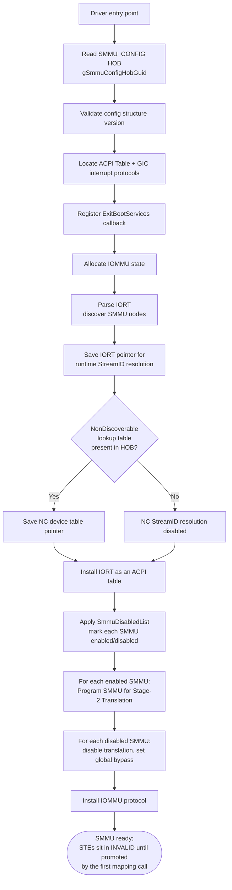
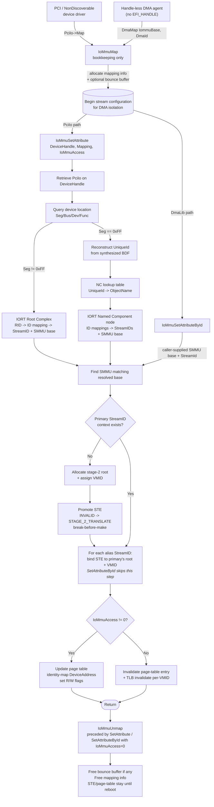

# SmmuDxe Driver

This document describes the System Memory Management Unit (SMMU) driver implementation, and how it integrates with the
DMA capable subsystem. The driver configures the SMMUv3 hardware and implements the IOMMU protocol to provide address
translation and memory protection for DMA operations.

## Architecture Overview

The SmmuDxe driver will consume the SMMU_CONFIG HOB with the IORT data to configure the SMMUs found on the platform.
It will set them up for Stage 2 Translation by default. SmmuDxe will install the IoMmu Protocol.
Translation table mapping can be done by leveraging the IoMmu Protocol. The protocol functions are outlined below.
Seperatley, an IoMmuLib is provided for platforms to use as an abstraction for locating and using the IoMmu protocol.
SmmuDxe will install the IORT ACPI Table. Platform should not install the IORT, but instead pass in the IORT data
with the SMMU_CONFIG HOB.

The system consists of four main components working together:

1. **PCI I/O Protocol**: Provides interface for PCI / NonDiscoverable device access and DMA operations (handle-aware path)
2. **DmaLib (`CoherentDmaLib` / `NonCoherentDmaLib`)**: Handle-less DMA path for firmware-internal agents; forwards
   caller-supplied `(IommuBase, DmaId)` to `IoMmuSetAttributeById`
3. **IOMMU Protocol**: Implements DMA remapping and memory protection (`SetAttribute` and `SetAttributeById` entry points)
4. **SMMU Hardware Driver**: Configures and manages the SMMU hardware

## IOMMU Protocol Integration

1. **PCI / NonDiscoverable Driver Initiates DMA** (handle-aware path):
   - Device driver calls `PciIo->Map()` / `PciIo->Unmap()`
   - SmmuDxe resolves the controller `EFI_HANDLE` → IORT → StreamID(s) + owning SMMU and programs the page table
     via `IoMmuSetAttribute`.

2. **Handle-less DMA Agent via DmaLib** (handle-less path):
   - Firmware-internal agents (no `EFI_HANDLE`, not in the IORT) call `DmaMap()` / `DmaUnmap()` from
     `EmbeddedPkg`'s `CoherentDmaLib` / `NonCoherentDmaLib`:

     ```c
     EFI_STATUS
     EFIAPI
     DmaMap (
       IN     DMA_MAP_OPERATION  Operation,
       IN     VOID               *HostAddress,
       IN OUT UINTN              *NumberOfBytes,
       IN     UINT64             IommuBase,    // SmmuV3 base address
       IN     UINT32             DmaId,        // StreamID on Arm SMMU
       OUT    PHYSICAL_ADDRESS   *DeviceAddress,
       OUT    VOID               **Mapping
       );
     ```

   - DmaLib calls `IoMmuMap` for bookkeeping, then forwards `(IommuBase, DmaId)` to `IoMmuSetAttributeById`.

3. **IOMMU Protocol Setup**:
   - Implements the IOMMU protocol:

     ```c
     struct _EDKII_IOMMU_PROTOCOL {
       UINT64                            Revision;
       EDKII_IOMMU_SET_ATTRIBUTE         SetAttribute;
       EDKII_IOMMU_MAP                   Map;
       EDKII_IOMMU_UNMAP                 Unmap;
       EDKII_IOMMU_ALLOCATE_BUFFER       AllocateBuffer;
       EDKII_IOMMU_FREE_BUFFER           FreeBuffer;
       EDKII_IOMMU_SET_ATTRIBUTE_BY_ID   SetAttributeById;
     };
     ```

   - SmmuDxe will handle Translation Table initialization

## DMA Mapping with IoMmuLib and IoMmu Protocol

- Maintains up to a 4-level page table, depending on configuration, to map HostAddress and DeviceAddress
- Identity Mapped

1. **IoMmu Map**:

   ```c
   EFI_STATUS
   EFIAPI
   IoMmuMap (
     IN     EDKII_IOMMU_OPERATION  Operation,
     IN     VOID                   *HostAddress,
     IN OUT UINTN                  *NumberOfBytes,
     OUT    EFI_PHYSICAL_ADDRESS   *DeviceAddress,
     OUT    VOID                   **Mapping
     );
   ```

- Maps HostAddress to DeviceAddress
- Validates operation type
- Called by PciIo protocol for mapping

### Bounce Buffering

In certain conditions, `IoMmuMap` will allocate a bounce buffer instead of using the original host address directly.
A bounce buffer is a temporary intermediate buffer that is used when the original DMA buffer
cannot be used directly by the device.

**Bounce Buffer Conditions:**

A bounce buffer is allocated when the operation is NOT `EdkiiIoMmuOperationBusMasterCommonBuffer` or
`EdkiiIoMmuOperationBusMasterCommonBuffer64`, AND any of the following conditions are met:

1. **Alignment Requirements Not Met:**
   - Alignment check for the start and end of the DMA buffer are needed so that we don't over-map
   a buffer in the page table. Page table mappings can only be done page-by-page.
   - The `NumberOfBytes` is not 4KB aligned, OR
   - The `HostAddress` (PhysicalAddress) is not 4KB aligned

2. **32-bit DMA Limitation:**
   - The operation is a 32-bit DMA operation (`EdkiiIoMmuOperationBusMasterRead` or
     `EdkiiIoMmuOperationBusMasterWrite`), AND
   - Any part of the DMA transfer range (`PhysicalAddress + NumberOfBytes`) exceeds 4GB

**Bounce Buffer Behavior:**

- When a bounce buffer is needed due to **alignment issues only** (with 64-bit operations), memory can be allocated
  anywhere in the address space
- When a bounce buffer is needed due to the **32-bit DMA limitation**, memory is allocated below 4GB using
  `AllocateMaxAddress` with `DmaMemoryTop` set to `SIZE_4GB - 1`
- The `DeviceAddress` returned points to the bounce buffer, not the original host address
- The `Mapping` handle stores information about both the original host address and the bounce buffer address

**CopyMem on Map (Host → Bounce Buffer):**

A `CopyMem` from the host buffer to the bounce buffer is performed during `IoMmuMap` when:

- A bounce buffer was allocated (NeedRemap is TRUE), AND
- The operation is a **read operation** from the Bus Master's perspective:
  - `EdkiiIoMmuOperationBusMasterRead`, OR
  - `EdkiiIoMmuOperationBusMasterRead64`

This copy ensures the Bus Master can read the correct data from the bounce buffer during the DMA operation.
For write operations, no copy is needed on Map since the Bus Master will write new data into the bounce buffer.

## DMA Unmapping with IoMmuLib and IoMmu Protocol

1. **PCI Driver Completes DMA**:
   - Calls PciIo->Unmap()
   - Provides mapping handle

2. **IoMmu Unmap**:

   ```c
   EFI_STATUS
   EFIAPI
   IoMmuUnmap (
     IN  VOID                  *Mapping
     );
   ```

   - Only does bounce buffer cleanup.
   - Caller must call SetAttributes(0) before IoMmuUnmap to remove R|W attributes to effectivley unmap the page table.

### Bounce Buffer Handling on Unmap

When unmapping a DMA operation that used a bounce buffer (i.e., `DeviceAddress != HostAddress`):

**CopyMem on Unmap (Bounce Buffer → Host):**

A `CopyMem` from the bounce buffer back to the host buffer is performed during `IoMmuUnmap` when:

- A bounce buffer was used (`DeviceAddress != HostAddress`), AND
- The operation is a **write operation** from the Bus Master's perspective:
  - `EdkiiIoMmuOperationBusMasterWrite`, OR
  - `EdkiiIoMmuOperationBusMasterWrite64`

This copy ensures the processor can access the data that the Bus Master wrote into the bounce buffer.
For read operations, no copy is needed on Unmap since the Bus Master only read data and did not modify it.

**Cleanup:**

- The bounce buffer pages are freed using `FreePages`
- The mapping information structure is freed

For direct mappings (no bounce buffer), only the mapping information structure is freed.

### DMA Access Attributes with IoMmuLib and IoMmu Protocol

1. Setting R/W permissions
   - After mapping an address with IoMmuMap()
   - Clearning R/W permissions before unmmapping an address with IoMmuUnmap()
   - Sets access permissions based on IoMmuAccess type:
      - When IoMmuAccess is not 0, R|W permissions are set.
      - When IoMmuAccess is 0, no read or write access is permitted.

2. IoMmu SetAttribute

   ```c
   EFI_STATUS
   EFIAPI
   IoMmuSetAttribute (
      IN EFI_HANDLE            DeviceHandle,
      IN VOID                  *Mapping,
      IN UINT64                IoMmuAccess
   );
   ```

   `SetAttribute` is the **worker** of the IOMMU protocol - `IoMmuMap` only allocates the `IOMMU_MAP_INFO`
   bookkeeping (and a bounce buffer if needed); it does **not** touch the SMMU page tables. All real page-table
   mutation happens here, on the `SetAttribute` call that follows `Map` (and on the `SetAttribute(..., 0)` that
   precedes `Unmap`).

   The `EFI_HANDLE DeviceHandle` parameter is how SmmuDxe knows *which* device (and therefore which StreamID(s) and
   which SMMU) to program:

   1. `gBS->HandleProtocol (DeviceHandle, &gEfiPciIoProtocolGuid, ...)` retrieves the `EFI_PCI_IO_PROTOCOL` instance
      installed on the handle. Both real PCIe devices (installed by `PciBusDxe`) and non-discoverable devices
      (installed by `NonDiscoverablePciDeviceDxe`) expose `PciIo` on the same handle the driver bound to.
   2. `PciIo->GetLocation (&Seg, &Bus, &Dev, &Func)` returns the BDF - for non-discoverable devices this is the
      synthesized `(0xFF, UniqueId>>5, UniqueId&0x1F, 0)`.
   3. `DeviceHandleToStreamId` uses `Seg` to dispatch: real PCIe goes through the IORT Root-Complex ID-mapping path,
      Segment `0xFF` goes through the NonDiscoverable lookup table + IORT Named Component path
      (see [Per-StreamID Isolation](#per-streamid-isolation)).
   4. The resolved primary StreamID's stage-2 page-table root and VMID are then used to actually
      install / invalidate the mapping for `MapInfo->DeviceAddress` with the requested `IoMmuAccess` permissions
      (or to tear it down when `IoMmuAccess == 0`).

   This is also why the controller handle had to be plumbed through `NonDiscoverablePciDeviceDxe` - its
   `PciIoMap`/`PciIoUnmap` now pass `Dev->Handle` to `IoMmuSetAttribute` instead of the old `NULL`, so SmmuDxe can do
   the resolution above for non-discoverable devices the same way it does for real PCIe.

3. IoMmu SetAttributeById

   ```c
   EFI_STATUS
   EFIAPI
   IoMmuSetAttributeById (
     IN EDKII_IOMMU_PROTOCOL  *This,
     IN UINT64                IommuBase,
     IN UINT32                DmaId,
     IN VOID                  *Mapping,
     IN UINT64                IoMmuAccess
   );
   ```

   `SetAttributeById` is for callers that **do not** have an `EFI_HANDLE` for the DMA agent - for example, firmware
   internal MMIO/DMA agents that are not described in the IORT and have no UEFI device handle. The caller is
   responsible for supplying the owning SMMU/IOMMU base address (`IommuBase`) and the `DmaId` (StreamID on Arm SMMU,
   RequesterID on VT-d) emitted by the device. Only that single `DmaId` is programmed; no IORT lookup or alias
   resolution is performed.

   The protocol now exposes both entry points:

   ```c
   struct _EDKII_IOMMU_PROTOCOL {
     UINT64                         Revision;       // EDKII_IOMMU_PROTOCOL_REVISION == 0x00010001
     EDKII_IOMMU_SET_ATTRIBUTE      SetAttribute;
     EDKII_IOMMU_MAP                Map;
     EDKII_IOMMU_UNMAP              Unmap;
     EDKII_IOMMU_ALLOCATE_BUFFER    AllocateBuffer;
     EDKII_IOMMU_FREE_BUFFER        FreeBuffer;
     EDKII_IOMMU_SET_ATTRIBUTE_BY_ID   SetAttributeById; // Optional; callers must NULL-check.
   };
   ```

   `EDKII_IOMMU_PROTOCOL_REVISION` was bumped to `0x00010001` to advertise `SetAttributeById`. Legacy producers that do
   not implement `SetAttributeById` leave the field `NULL`; callers (and `IoMmuLib::IoMmuSetAttributeById`) must check
   before invoking.

## Per-StreamID Isolation

Each DMA-capable device gets its own stage-2 page-table root and VMID. Mappings made for one device are **not**
visible to any other device. Conceptually, on every `IoMmuSetAttribute` / `IoMmuSetAttributeById` call the driver:

1. Resolves the caller (device handle, or a caller-supplied `(IommuBase, DmaId)` for the handle-less path) to:
   - One or more StreamIDs.
   - The base address of the SMMU node that owns them.

   For handle-aware callers this resolution walks the platform IORT (and the optional NonDiscoverable lookup table -
   see [Non-Discoverable Device Integration](#non-discoverable-device-integration)).
2. Selects the matching SMMU instance by that base address.
3. For the **primary** (first) StreamID, lazily allocates a stage-2 page-table root and a VMID on demand and
   promotes the Stream Table Entry (STE) from `INVALID` to `STAGE_2_TRANSLATE` using break-before-make.
4. Aliases every additional StreamID reported for the same device onto the primary's root and VMID (its STE is
   promoted to point at the same root). A single page-table update therefore covers DMA from all StreamIDs that
   belong to one logical device.
5. Updates the page table with the requested permissions (or tears the mapping down when permissions are cleared).

### Page table root (S2TTB) and VMID

Stage-2 page tables on the SMMU are tagged by VMID. The SMMU caches TLB entries keyed by `(VMID, IPA)`, and the STE
for a StreamID carries an `S2VMID` field that selects which page tables the SMMU walks for that stream. Two streams
with two different page-table roots **must** have two different VMIDs.

Each page-table root therefore needs its own VMID. Each STE gets a unique VMID unless the driver explicitly wants
to share that STE's page-table root with another stream (the alias case below):

- The STE itself is the single source of truth for the `(Root, Vmid)` binding. On the first mapping for a StreamID
  a fresh VMID and root are allocated and the STE is promoted; on subsequent mappings the existing binding is read
  back from the live STE's `S2Ttb` / `S2Vmid` fields. VMID `0` is reserved as "unassigned".
- VMID width comes from the SMMU's `IDR0.VMID16` capability: 8-bit SMMUs use values `1..0xFF`, 16-bit SMMUs use
  `1..0xFFFF`. A VMID is never reused for a different root within the same boot.
- Aliasing does the inverse: given the **primary's** `(Root, Vmid)`, the alias STE is promoted in place to point
  at the same root with the same `S2VMID`. If the alias STE already encodes the same `(Root, Vmid)` this is a
  no-op. That's how multiple StreamIDs share one mapping - they all resolve through the same VMID tag, so a
  single TLB invalidation by `(VMID, IPA)` covers every alias.
- On unmap the driver invalidates by VMID. Because the VMID is unique per page-table root, that invalidation can't
  accidentally evict another device's translations.

### End-to-end Flow Diagram

#### Driver Initialization



After init the SMMU hardware is configured but **no device is mapped yet**. Every STE is in `INVALID` until
promoted, so any unsolicited DMA is dropped. STEs are promoted to `STAGE_2_TRANSLATE` lazily on the first
`IoMmuSetAttribute` / `IoMmuSetAttributeById` call for that StreamID.

#### Runtime Map / SetAttribute / Unmap



The diagram shows three caller paths that converge on the same per-StreamID isolation logic:

- **Map only does bookkeeping.** It allocates the mapping info (and a bounce buffer if needed) and returns a
  handle. No STE or page-table is touched. The `DmaLib` wrappers (`CoherentDmaLib` / `NonCoherentDmaLib`) call
  straight into `IoMmuMap` and then forward the caller-supplied `(IommuBase, DmaId)` to `IoMmuSetAttributeById`
  instead of using a handle.
- **SetAttribute is the worker for handle-aware callers.** It resolves the handle to StreamID(s) and SMMU base via
  the IORT, lazily creates a per-stream stage-2 root + VMID and promotes the STE on first use, aliases additional
  StreamIDs onto that root, then either installs (`IoMmuAccess != 0`) or tears down (`IoMmuAccess == 0`) the
  identity mapping for the DMA address.
- **SetAttributeById is the handle-less variant** used by `DmaLib` (and any other firmware-internal DMA agent that
  isn't described in the IORT). It skips both the handle-to-location lookup and the alias-binding loop - only the
  single `(IommuBase, DmaId)` the caller provided is promoted and programmed.
- **Unmap** is purely cleanup of the mapping info and any bounce buffer. The STE and page tables stay promoted for
  the lifetime of UEFI; on `ExitBootServices` the SMMU is flipped to global bypass + BME-off so the OS can take
  over cleanly.

## Non-Discoverable Device Integration

Non-PCI MMIO devices registered through `MdeModulePkg/Library/NonDiscoverableDeviceRegistrationLib` are bound by
`NonDiscoverablePciDeviceDxe`, which synthesizes a `PciIo` instance over them. The driver no longer auto-assigns a
counter-based BDF; instead the platform supplies a deterministic `UniqueId` at registration time:

```c
EFI_STATUS
EFIAPI
RegisterNonDiscoverableMmioDevice (
  IN      UINTN                             UniqueId,   // platform-assigned, must be unique
  IN      NON_DISCOVERABLE_DEVICE_TYPE      Type,
  IN      NON_DISCOVERABLE_DEVICE_DMA_TYPE  DmaType,
  IN      NON_DISCOVERABLE_DEVICE_INIT      InitFunc,
  IN OUT  EFI_HANDLE                        *Handle OPTIONAL,
  IN      UINTN                             NumMmioResources,
  ...
  );
```

The `UniqueId` is stored on the `NON_DISCOVERABLE_DEVICE` protocol and copied into the `NON_DISCOVERABLE_PCI_DEVICE`
instance by `NonDiscoverablePciDeviceDxe`. `PciIo->GetLocation()` then returns a deterministic
`(Segment = 0xFF, Bus = UniqueId >> 5, Device = UniqueId & 0x1F, Function = 0)`. SmmuDxe uses Segment `0xFF` to
detect a non-discoverable device and switch from the PCI Root-Complex lookup path to the Named Component lookup
path.

`NonDiscoverablePciDeviceDxe` also remembers the controller `EFI_HANDLE` on the `NON_DISCOVERABLE_PCI_DEVICE` and
passes it (instead of `NULL`) to `IoMmuSetAttribute` from its `PciIoMap` / `PciIoUnmap` implementations, so SmmuDxe
can resolve the DMA identifier through the IORT.

### Mapping a Non-Discoverable Device to an IORT Named Component

To enable SMMU translation for a non-discoverable device, the platform must:

1. Add a **Named Component** node to the IORT whose `ObjectName` matches the device (e.g. `"USB"`) and whose
   ID mappings produce the StreamIDs the device emits. The Named Component's `OutputReference` must point at the
   SMMUv3 node that owns those StreamIDs.
2. Publish a **NonDiscoverable lookup table** in the `SMMU_CONFIG` HOB that maps each registered `UniqueId` to the
   matching IORT NC `ObjectName`:

   ```c
   typedef struct _SMMU_NC_DEVICE_ENTRY {
     UINT64    UniqueId;                              // Same UniqueId passed to RegisterNonDiscoverableMmioDevice().
     CHAR8     ObjName[SMMU_NC_DEVICE_OBJNAME_MAX];   // IORT Named Component ObjectName (NUL-terminated).
   } SMMU_NC_DEVICE_ENTRY;
   ```

   Example - one xHCI controller registered with `UniqueId == 1` whose IORT Named Component node is named `"USB"`,
   plus an SATA AHCI controller registered with `UniqueId == 2`:

   ```c
   STATIC CONST SMMU_NC_DEVICE_ENTRY  NcDeviceTable[] = {
     // { UniqueId, IORT NC ObjectName }
     { 0x1, "USB"       },
     { 0x2, "SATA_AHCI" },
   };
   ```

   Each entry's `UniqueId` is exactly the value the platform passed to `RegisterNonDiscoverableMmioDevice`, and the
   `ObjName` must character-for-character match the `ObjectName` field of an `EFI_ACPI_IORT_TYPE_NAMED_COMP` node in
   the IORT blob. SmmuDxe uses this two-step lookup (UniqueId → ObjectName → IORT NC node → StreamID list +
   owning SMMU base) every time a non-discoverable device calls `IoMmuSetAttribute`.

3. Point the new `NcDeviceListSize`/`NcDeviceListOffset` fields in `SMMU_CONFIG` at that table (see
   [SMMU_CONFIG HOB Layout](#smmu_config-hob-layout)).

At translation time, when `PciIo->GetLocation()` returns Segment `0xFF`, SmmuDxe reconstructs the original
`UniqueId` from `(Bus << 5) | (Device & 0x1F)`, looks it up in the NC table to get an `ObjectName`, walks the IORT
for a Named Component node with that name, and **uses every StreamID in that node's ID mappings** - not just one.

This is where the alias logic from [Per-StreamID Isolation](#per-streamid-isolation) begins: the first StreamID
returned becomes the **primary** and gets its own stage-2 page-table root and VMID. Every other StreamID emitted
by the same IORT NC node is then **aliased** so its STE points at the *same* root and uses the *same* VMID. The
device therefore sees one unified mapping no matter which of its StreamIDs the transaction was tagged with.

```text
NC HOB                    IORT Named Component                  SMMU stage-2
+-----------+   match     +---------------------+   ID maps     +-----------------+
| UniqueId  |  -------->  | ObjectName = "USB"  |  ----------> | Primary SID  -> Root R, VMID V
| ObjName   |             |   - StreamID 0x10   |               | Alias  SID  -> Root R, VMID V (shared)
+-----------+             |   - StreamID 0x11   |               | Alias  SID  -> Root R, VMID V (shared)
                          +---------------------+               +-----------------+
```

Adding or removing alias StreamIDs is therefore purely an IORT edit - the platform NC table stays small and only
needs one entry per logical device.

## SMMU_CONFIG HOB Layout

The platform builds one HOB (`gSmmuConfigHobGuid`) containing the `SMMU_CONFIG` header followed (in any order) by the
IORT blob, the optional SMMU disable list, and the optional NonDiscoverable device lookup table. Each section is
located via its offset and size in the header:

```c
typedef struct _SMMU_CONFIG {
  UINT32    VersionMajor;
  UINT32    VersionMinor;
  UINT32    SmmuDisabledListSize;   // Size of SmmuDisabledList in bytes.
  UINT32    SmmuDisabledListOffset; // Offset to the SmmuDisabledList from the start of the HOB.
  UINT32    IortSize;
  UINT32    IortOffset;             // Offset to the IORT table from the start of the HOB.
  UINT32    NcDeviceListSize;       // Size of the NonDiscoverable lookup array, in bytes.
  UINT32    NcDeviceListOffset;     // Offset to the NonDiscoverable lookup array. 0 if absent.
} SMMU_CONFIG;
```

Visual layout (one possible ordering):

```text
+----------------------------+
|         SMMU_CONFIG        |  header
+----------------------------+  <-- IortOffset
|       IORT table data      |  IortSize bytes
+----------------------------+  <-- NcDeviceListOffset
| SMMU_NC_DEVICE_ENTRY[ N ]  |  NcDeviceListSize bytes (multiple of sizeof(SMMU_NC_DEVICE_ENTRY))
+----------------------------+  <-- SmmuDisabledListOffset (optional)
|     UINT64 disabledBases[] |  SmmuDisabledListSize bytes
+----------------------------+
```

## SMMU Configuration

### 1. SMMUv3 Hardware Setup

The SMMU is configured in stage 2 translation mode with:

- Stream table for device ID mapping
- Command queue for SMMU operations, like TLB management
- Event queue for error handling
- 4KB translation granule

### 2. Page Table Structure

The IOMMU uses up to a 4-level page table structure for DMA address translation:
<https://developer.arm.com/documentation/101811/0104/Translation-granule/The-starting-level-of-address-translation>

Depending on configuration from the SMMU registers, the starting level of translation is chosen.
Depending on the SMMU configuration found, also supports Concatenated Translation Tables for the
Translation Table Base.

### 3. Address Translation Process

1. **Device Issues DMA**:
   - Device uses IOVA (I/O Virtual Address)
   - SMMU intercepts access

2. **SMMU Translation**:
   - Looks up Stream Table Entry (STE)
      - 2 level or Linear Stream Table. Depending on configurable maximum StreamId via IORT.
   - Walks up to 4-level page tables
   - Converts IOVA to PA (Physical Address)

### Leaf Page Table Entry Updates and Break-Before-Make

ARM's break-before-make (BBM) rule applies when a *live* leaf entry's PA / attributes change in place - without an
Invalid+TLBI step in between, a concurrent walk can observe a torn entry. `UpdateMapping` (`IoMmu.c`) skips BBM
because the only transitions it performs on a leaf are **Invalid ↔ Valid**; PA and flags are never rewritten on a
Valid entry.

That invariant is enforced on the map path: if the leaf is already valid, the new `Entry` must be byte-for-byte
identical, otherwise `EFI_DEVICE_ERROR` is returned instead of overwriting in place.

## Memory Protection

The IOMMU protocol provides several protection mechanisms:

1. **Access Control**:
   - Read/Write permissions per mapping
   - Device isolation through Stream IDs

2. **Address Range Protection**:
   - Validates DMA addresses
   - Prevents access outside mapped regions

3. **Error Handling**:
   - Translation faults logged to Event Queue
   - See [SMMU Fault Reporting via GIC Interrupts](#smmu-fault-reporting-via-gic-interrupts) for how faults are
     surfaced at runtime.

### SMMU Fault Reporting via GIC Interrupts

SmmuDxe hooks the SMMU's two error-reporting interrupts so translation faults and command/global errors are surfaced
the moment they happen instead of being noticed only on the next mapping call:

- **EVTQ IRQ** - fires when the SMMU pushes an entry into its **Event Queue** (e.g. a stage-2 translation fault for
  some StreamID, a forbidden access, a CD/STE fetch fault, etc.). Each SMMU carries the per-SMMU `EvtqIrqNum`
  parsed from the IORT SMMUv3 node.
- **GERR IRQ** - fires on **Global Errors** reported through `GERROR` / `GERRORN` (command-queue consumer faults,
  MSI write errors, queue overflow, etc.). Tracked as `GerrIrqNum`.

#### Configuration path

1. During driver init the SMMU driver locates the platform's GIC interrupt producer (the EDK II
   `HardwareInterrupt2` protocol) and caches it. If the protocol isn't present, IRQ hookup is skipped
   (non-fatal) - faults will only be surfaced on the next mapping call.
2. For each enabled SMMU, both the EVTQ IRQ and the GERR IRQ are registered with a shared ISR: the source is bound
   to the handler, configured as edge-rising, and enabled at the GIC.
3. The SMMU itself is programmed (in the same configure path) to deliver these IRQs as wired SPIs through the GIC.
   MSI delivery is not used here - the IORT-supplied SPI numbers are routed directly.

#### Runtime handling

The shared ISR runs at GIC dispatch:

1. Walks the driver's SMMU list to find the enabled SMMU whose EVTQ IRQ or GERR IRQ matches the firing source.
2. Drains and pretty-prints every queued Event Queue entry plus the latched `GERROR` bits, then asserts so the
   failure is loud during development.
3. Always signals end-of-interrupt to the GIC to deassert the IRQ.

The same error-logging is also invoked opportunistically from `IoMmuSetAttribute` / `IoMmuSetAttributeById` so
anything that slipped past the IRQ path (or was raised while interrupts were masked) is still surfaced on the next
mapping call.

## Continuous Protection Through the OS

### SMMU Initialization Pre-DXE

To ensure continuous protection, the SMMU should be set in abort mode during the pre-DXE phase. This means that the SMMU
will block all transactions unless explicitly configured to allow them. This setup ensures that no unauthorized DMA
operations can occur before the SMMU is fully configured.

### Interaction with PcdDisableBMEonEBS

The PcdDisableBMEonEBS (Disable Bus Master Enable on Exit Boot Services) setting plays a crucial role in maintaining
system security during the transition from firmware to the operating system.

The following steps outline the end-to-end interaction:

1. Pre-DXE Initialization:

   The SMMU is set to abort mode to block all transactions. This ensures that no DMA operations can bypass the SMMU's
   protection mechanisms.

2. DMA Remapping with SMMU:

   The SMMU is configured to translate addresses and manage memory protection.
   The SMMU's page tables and stream tables are set up to allow only authorized DMA operations.

3. Exit Boot Services (EBS):

   `SmmuV3ExitBootServices` runs at `TPL_NOTIFY` for every enabled SMMU and decides per-SMMU between two terminal
   states based on `SMMU_INFO->EBSBehaviorAbort`:

   - **Default - `SmmuV3GlobalAbort`.** The SMMU is flipped into global-abort: every StreamID, including those that
     were translated during UEFI, has its transactions aborted. Translation is then disabled
     (`SmmuV3DisableTranslation`). This is the safe default: nothing can DMA until the OS reprograms the SMMU.
   - **Opt-out for SMMUs with RMR-mapped streams - `SmmuV3SetGlobalBypass`.** If any IORT RMR range was pre-mapped
     under this SMMU during init (`EBSBehaviorAbort == FALSE`), the SMMU is set to global-bypass instead so the
     reserved-memory devices the firmware handed off to the OS (UEFI runtime framebuffer, etc.) keep working until
     the OS rebinds them. Translation is still disabled. **Other SMMUs without RMRs are unaffected - their
     StreamIDs are still protected** until the OS reconfigures them.
   - In addition, `PcdDisableBMEonEBS` controls clearing the PCI Bus Master Enable bit on PCI controllers, which
     prevents any PCIe device from initiating new DMA in the abort window.

   The net effect: SMMUs that must keep RMR streams alive go to bypass; every other SMMU stays in abort. There is no
   point in the handoff where a previously-protected StreamID can DMA freely against memory it didn't have a mapping
   for during UEFI.

4. OS Reconfiguration:

   The operating system reconfigures the SMMU as needed for its own DMA remapping and memory protection requirements.
   By following these steps, the system ensures that the SMMU provides continuous protection from the pre-DXE phase
   through to the operating system's reconfiguration. This approach helps prevent unauthorized DMA operations and
   maintains system security.

## Limitations

Current implementation constraints:

1. Supports cache coherent SMMUs only
2. Fixed 4KB granule size
3. 48-bit address space limit
4. Stage 2 translation only
   - Stage 2 is used on its own (no Stage 1, no nested Stage 1+2) to keep the firmware translation model the same
     regardless of whether the OS that takes over is a bare-metal kernel or a hypervisor.
     By only ever programming Stage 2, firmware hands off a translation regime that for live
     handoff scenarios both a hypervisor and a bare-metal OS can simply re-use the Stage 2 structures for its own
     DMA-isolation page tables.
   - Stage 2 offers simpler Stream Table strucutres without the need of Context Descriptors.
5. Only Identity-mapped page tables are supported (one per StreamID, allocated lazily on first `IoMmuSetAttribute` for that StreamID)

## Future Enhancements

Potential improvements:

1. Multiple translation granule support
2. Different page table mapping schemes besides Identiy-Mapping
3. Updated IoMmu Protocol to optimize redundancies
4. Bounce Buffer Optimization
   - Remove the `NumberOfBytes` end address alignment check in `IoMmuMap`
   - Update individual drivers to allocate their DMA buffers by page (page-aligned and page-sized)
   - This eliminates one case for bounce buffering, improving performance by avoiding unnecessary
     buffer copies and allocations when only the end address is unaligned

## Configuration Options

Key SMMU settings controlled through the SMMU config HOB:

- **IORT data:** The complete IORT table data that the SMMU(s) will be configured with. Located by
  `IortOffset` / `IortSize`. SmmuDxe walks this both at init (to discover SMMU nodes / RMR ranges) and at runtime
  (to resolve `DeviceHandle` → StreamID for `IoMmuSetAttribute`).

- **SmmuDisabledList:** Provides the platform the ability to individually disable/bypass an SMMU if needed.
  This list is a `UINT64[]` of SMMU base addresses that the platform wants to disable/bypass, located by
  `SmmuDisabledListOffset` / `SmmuDisabledListSize`. By default every SMMU found in the IORT is configured for
  Stage 2 Translation; any SMMU whose base appears in this list is instead set to global-bypass.

- **NonDiscoverable device lookup table (`NcDeviceListOffset` / `NcDeviceListSize`):** Maps each platform-assigned
  `UniqueId` (the value passed to `RegisterNonDiscoverableMmioDevice`) to the matching IORT Named Component
  `ObjectName`. SmmuDxe uses this two-step lookup
  (`UniqueId → ObjectName → IORT NC node → StreamID(s) + owning SMMU base`) every time a non-discoverable device
  calls `IoMmuSetAttribute`. Omit the table (or leave the offset/size as `0`) only if the platform has no
  non-discoverable DMA-capable devices; otherwise NC StreamID resolution will fail. See
  [Mapping a Non-Discoverable Device to an IORT Named Component](#mapping-a-non-discoverable-device-to-an-iort-named-component)
  for the entry format and an example.

## Platform Integration Instructions

Generic Platform Integration:

1. **Build the IORT.** Include one SMMUv3 node, the necessary ITS / Root Complex nodes for PCI, and one
   `EFI_ACPI_IORT_TYPE_NAMED_COMP` node per non-discoverable DMA-capable device. Each Named Component's ID mappings
   must produce the StreamIDs the device emits and reference the owning SMMUv3 node.

2. **Register non-discoverable devices with a stable `UniqueId`** using `RegisterNonDiscoverableMmioDevice`. The same
   `UniqueId` is what SmmuDxe will reconstruct from `PciIo->GetLocation()` later, so it must be unique across all
   registrations on the platform.

3. **Publish the SMMU_CONFIG HOB** (`gSmmuConfigHobGuid`). Append (in any order) the IORT blob, the NC device lookup
   table (see [Non-Discoverable Device Integration](#non-discoverable-device-integration)), and the optional SMMU
   disable list, then point the offsets/sizes in the `SMMU_CONFIG` header at them. Example:

   ```c
   STATIC CONST SMMU_NC_DEVICE_ENTRY  NcDeviceTable[] = {
     { /* UniqueId */ 0x1, /* IORT NC ObjectName */ "USB" },
   };

   SmmuConfig = AllocateZeroPool (sizeof (SMMU_CONFIG) + sizeof (IortData) + sizeof (NcDeviceTable));
   SmmuConfig->VersionMajor       = CURRENT_SMMU_CONFIG_VERSION_MAJOR;
   SmmuConfig->VersionMinor       = CURRENT_SMMU_CONFIG_VERSION_MINOR;
   SmmuConfig->IortSize           = sizeof (IortData);
   SmmuConfig->IortOffset         = sizeof (SMMU_CONFIG);
   SmmuConfig->NcDeviceListSize   = sizeof (NcDeviceTable);
   SmmuConfig->NcDeviceListOffset = sizeof (SMMU_CONFIG) + sizeof (IortData);

   CopyMem ((UINT8 *)SmmuConfig + SmmuConfig->IortOffset,         &IortData,    sizeof (IortData));
   CopyMem ((UINT8 *)SmmuConfig + SmmuConfig->NcDeviceListOffset,  NcDeviceTable, sizeof (NcDeviceTable));

   BuildGuidDataHob (&gSmmuConfigHobGuid, SmmuConfig, sizeof (SMMU_CONFIG) + sizeof (IortData) + sizeof (NcDeviceTable));
   ```

4. **Do not install the IORT yourself** - SmmuDxe installs it as an ACPI table after parsing.

5. **Disable specific SMMUs (optional).** Append a `UINT64[]` of SMMU base addresses to put in bypass mode and point
   `SmmuDisabledListOffset` / `SmmuDisabledListSize` at it.

6. **Handle-less DMA agents (optional).** Firmware components that have no UEFI device handle (and therefore are not
   in the IORT) can program the SMMU directly through `IoMmuLib::IoMmuSetAttributeById (IommuBase, DmaId, ...)`. The
   caller is responsible for supplying the correct SMMU base and DMA identifier.

Integration with Qemu:

- SMMU is supported on Qemu v9.1.50+  

## Relevant Docs

- SMMUv3 specification <https://developer.arm.com/documentation/ihi0070/latest/>
- Useful ARM SMMU documentation - <https://developer.arm.com/documentation/109242/0100/Programming-the-SMMU>
- Arm AArch64 memory management guide - <https://developer.arm.com/documentation/101811/0104>
- ARM a_a-profile_architecture_reference_manual <https://developer.arm.com/documentation/ddi0487/mc/>
- Intel IOMMU for DMA protection in UEFI <https://www.intel.com/content/dam/develop/external/us/en/documents/intel-whitepaper-using-iommu-for-dma-protection-in-uefi.pdf>
- IORT documentation <https://developer.arm.com/documentation/den0049/latest/>
