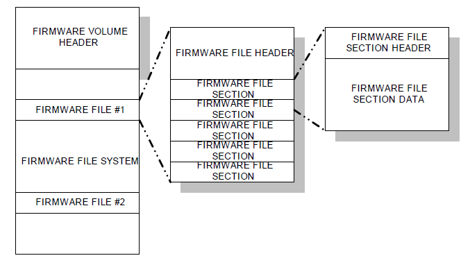
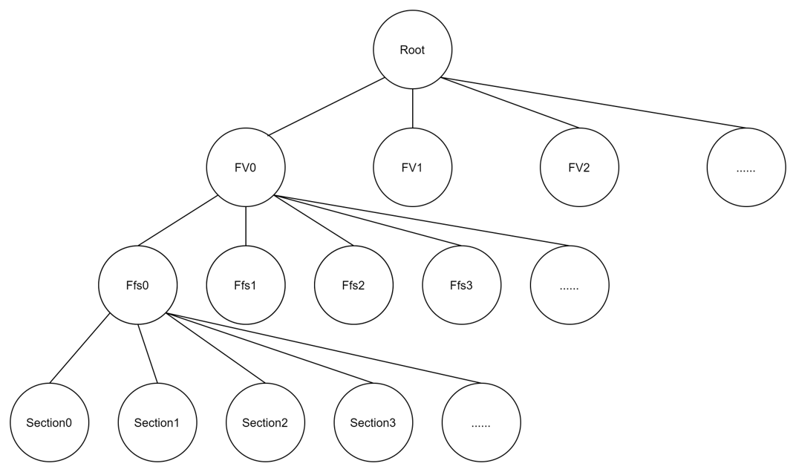

# FMMT
## Overview
This FMMT tool is the python implementation of the edk2 FMMT tool which locates at https://github.com/tianocore/edk2-staging/tree/FceFmmt.
This implementation has the same usage as the edk2 FMMT, but it's more readable and relaiable.

# FMMT User Guide

#### Last updated April 28, 2022

Important Changes and Updates:

- Oct 13, 2021 Initial Draft of FMMT Python Tool
- Apr 28, 2022 Optimize functions & Command line

#### Note:

- FMMT Python Tool keeps same function with origin FMMT C Tool. It is much easier to maintain and extend other functions.

#### Known issue:

- Currently, FMMT Python tool does not support PEIM rebase feature, this feature will be added in future update.

# 1. Introduction

## 1.1  Overview

The Firmware Device is a persistent physical repository that contains firmware code and/or data. The firmware code and/or data stored in Firmware Volumes. Detail layout of Firmware Volumes is described in ?Figure 1. The Firmware Volume Format?.

?                                                   Figure 1. The Firmware Volume Format

In firmware development, binary file has its firmware layout following the Platform-Initialization Specification. Thus, operation on FV file / FFS file (Firmware File) is an efficient and convenient way for firmware function testing and developing. FMMT Python tool is used for firmware files operation.

## 1.2  Tool Capabilities

The FMMT tool is capable of:

- Parse a FD (Firmware Device) / FV (Firmware Volume) / FFS (Firmware Files)

- Add a new FFS into a FV file (both included in a FD file or not)

- Replace an FFS in a FV file with a new FFS file

- Delete an FFS in a FV file (both included in a FD file or not)

-  Extract the FFS from a FV file (both included in a FD file or not)

## 1.3  References

| Document                                         |
| ------------------------------------------------ |
| UEFI Platform Initialization (PI)  Specification |

# 2. FMMT Python Tool Usage

## 2.1  Required Files

### 2.1.1  Independent use

When independent use the FMMT Python Tool, the following files and settings are required:

- GuidTool executable files used for Decompress/Compress Firmware data.

- Environment variables path with GuidTool path setting.

### 2.1.2  Use with Build System

When use the FMMT Python Tool with Build System:

-  If only use Edk2 based GuidTool, do not need other preparation.

- If use other customized GuidTool, need prepare the config file with GuidTool info. The syntax for GuidTool definition shown as follow:

  ***ToolsGuid ShortName Command***

  -- Example:  ***3d532050-5cda-4fd0-879e-0f7f630d5afb BROTLI BrotliCompress***

## 2.2  Syntax

### 2.2.1  Syntax for Parse file

  ***-v < Inputfile > < Outputfile > -l < LogFileType > -c < ConfigFilePath >***

- Parse *Inputfile*, show its firmware layout with log file. *Outputfile* is optional, if inputs, the *Inputfile* will be encapsulated into *Outputfile* following the parsed firmware layout. *"-l LogFileType"* is optional, it decides the format of log file which saves Binary layout. Currently supports: json, txt. More formats will be added in the future. *"-c ConfigFilePath "* is optional, target FmmtConf.ini file can be selected with this parameter. If not provided, default FmmtConf.ini file will be used.
- Ex: py -3 FMMT.py -v test.fd

### 2.2.2  Syntax for Add a new FFS

  ***-a  < Inputfile > < TargetFvName/TargetFvGuid > < NewFfsFile > < Outputfile >***

- Add the *NewFfsFile* into *Inputfile*. *TargetFvName/TargetFvGuid* (Name or Guid) is the TargetFv which *NewFfsFile* will be added into.
- Ex: py -3 FMMT.py -a Ovmf.fd 6938079b-b503-4e3d-9d24-b28337a25806 NewAdd.ffs output.fd

### 2.2.3  Syntax for Delete an FFS

  ***-d  < Inputfile > < TargetFvName/TargetFvGuid > < TargetFfsName > < Outputfile >***

- Delete the Ffs from *Inputfile*. TargetFfsName (Guid) is the TargetFfs which will be deleted. *TargetFvName/TargetFvGuid* is optional, which is the parent of TargetFfs*.*
- Ex: py -3 FMMT.py -d Ovmf.fd 6938079b-b503-4e3d-9d24-b28337a25806 S3Resume2Pei output.fd

### 2.2.4  Syntax for Replace an FFS

?  ***-r  < Inputfile > < TargetFvName/TargetFvGuid > < TargetFfsName > < NewFfsFile > < Outputfile >***

- Replace the Ffs with the NewFfsFile. TargetFfsName (Guid) is the TargetFfs which will be replaced. *TargetFvName/TargetFvGuid* is optional, which is the parent of TargetFfs*.*
- Ex: py -3 FMMT.py -r Ovmf.fd 6938079b-b503-4e3d-9d24-b28337a25806 S3Resume2Pei NewS3Resume2Pei.ffs output.fd

### 2.2.5  Syntax for Extract an FFS

  ***-e  < Inputfile > < TargetFvName/TargetFvGuid > < TargetFfsName > < Outputfile >***

- Extract the Ffs from the Inputfile. TargetFfsName (Guid) is the TargetFfs which will be extracted. *TargetFvName/TargetFvGuid* is optional, which is the parent of TargetFfs*.*
- Ex: py -3 FMMT.py -e Ovmf.fd 6938079b-b503-4e3d-9d24-b28337a25806 S3Resume2Pei output.fd

# 3. FMMT Python Tool Design

FMMT Python Tool uses the NodeTree saves whole Firmware layout. Each Node have its Data field, which saves the FirmwareClass(FD/FV/FFS/SECTION/BINARY) Data. All the parse/add/delete/replace/extract operations are based on the NodeTree (adjusting the layout and data).

## 3.1  NodeTree

A whole NodeTree saves all the Firmware info.

- Parent & Child relationship figured out the Firmware layout.

- Each Node have several fields. ?Data? field saves an FirmwareClass instance which contains all the data info of the info.

### 3.1.1  NodeTree Format

The NodeTree will be created with parse function. When parse a file, a Root Node will be initialized firstly. The Data split and Tree construction process is described with an FD file shown as ?Figure 2. The NodeTree format?:

- A Root Node is initialized.

- Use the ?FV Signature? as FV key to split Whole FD Data. ?FV0?, ?FV1?, ?FV2?? Node created.

- After FV level Node created, use the ?Ffs Data Size? as FFS key to split each FV Data. ?Ffs0?...Node created.

- After FFS level Node created, use the ?Section Data Size? as Section key to split each Ffs Data. ?Section0?...Node created.

- If some of Section includes other Sections, continue use the ?Section Data Size? as Section key to split each Section Data.

- After all Node created, the whole NodeTree saves all the info. (Can be used in other functions or print the whole firmware layout into log file)

?                                                         Figure 2. The NodeTree format

### 3.1.2  Node Factory and Product

As 3.1.1, Each Node is created by data split and recognition. To extend the NodeTree usage, Factory pattern is used in Node created process.

Each Node have its Factory to create Product and use Product ParserData function to deal with the data.

## 3.2  GuidTool

There are two ways to set the GuidTool. One from Config file, another from environment variables.

Current GuidTool first check if has Config file.

- If have, load the config GuidTool Information.

- Else get from environment variables.

### 3.2.1  Get from Config file

- Config file should in same folder with FMMT.py or the path in environment variables.

- Content should follow the format:

  ***ToolsGuid ShortName Command***

### 3.2.2  Get from Environment Variables

- The GuidTool Command used must be set in environment variables.

### 3.2.3  Edk2 Based GuidTool

| ***Guid***                                 | ***ShortName*** | ***Command***         |
| ------------------------------------------ | --------------- | --------------------- |
| ***a31280ad-481e-41b6-95e8-127f4c984779*** | ***TIANO***     | ***TianoCompress***   |
| ***ee4e5898-3914-4259-9d6e-dc7bd79403cf*** | ***LZMA***      | ***LzmaCompress***    |
| ***fc1bcdb0-7d31-49aa-936a-a4600d9dd083*** | ***CRC32***     | ***GenCrc32***        |
| ***d42ae6bd-1352-4bfb-909a-ca72a6eae889*** | ***LZMAF86***   | ***LzmaF86Compress*** |
| ***3d532050-5cda-4fd0-879e-0f7f630d5afb*** | ***BROTLI***    | ***BrotliCompress***  |
