# Memory Bin Feature

## Table of Contents

## Background

The ACPI spec defines the S4 sleep state as the lowest power state it defines. In this sleep state, the OS or platform
FW is responsible for saving the running context in a persistent location. Upon resumption from S4, this running context
needs to be restored to memory and whatever device state is required. Platform FW is responsible for bringing the system
out of S4 and returning to the OS, who generally is the one to restore system context. Because the OS needs to return
the system memory to exactly the state it was before, it must use the same memory regions as it did the previous boot.
In order to do this, UEFI must have the same runtime memory footprint it did on the previous boot.

The edk2 memory bin feature is designed to support the S4 sleep state's requirements to keep UEFI's runtime memory
footprint identical between boots of the same FW.

## Implementation

### Overview

There are 5 types of UEFI memory that persist into the OS timeframe: EfiReservedMemoryType, EfiRuntimeServicesCode,
EfiRuntimeServicesData, EfiACPIMemoryNVS, and generally EfiACPIReclaimMemory (the OS is allowed to reclaim this, but
typically does not). edk2 allows a platform to define a memory bin size for each of these memory types, as desired.
Technically, any type can be requested to use a memory bin, but the real use case is for the runtime types.

The DXE and PEI (if configured) allocators will attempt to allocate all runtime types in the memory bin defined for
them. If the allocation size is too large, it will allocate it elsewhere. Runtime memory may also be allocated by
address outside the bin or reported as a Resource Descriptor HOB; neither of these will land in the memory bin.

When the EFI_BOOT_SERVICES.GetMemoryMap() API is called, edk2 will examine the memory bin sizes defined by the
platform and create an EFI_MEMORY_MAP descriptor that is the bin size (assuming allocations are lower than the defined
size). This way, any fluctuations in runtime memory usage are covered by the defined bin size, i.e. the bin size is an
overallocation of runtime memory usage which allows for stability during S4 resumes.

### MemoryBinLib

MemoryBinLib is the phase agnostic memory bin logic. This logic is shared between DXE core and PEI core to have
standardized memory bin operation. It handles HOB processing and production (for PEI), memory bin setup in the various
forms, and memory statistics.

### Boot Flow

A platform opts into either PEI + DXE memory bins or DXE only (the original implementation). A platform may also define
where the memory bin region is. All of these paths are defined below.

#### Platform Configuration

A platform opts into the memory bin feature by producing the
[Memory Type Information HOB](https://github.com/tianocore/edk2/blob/HEAD/MdeModulePkg/Include/Guid/MemoryTypeInformation.h).
This HOB defines the type and size of each bin. If this HOB is not produced, no version of memory bins will be used and
runtime allocations will fall wherever the allocator finds space, likely breaking S4 resume.

A platform can also define where the memory bins should be allocated by creating a resource descriptor HOB with the
owner set to gEfiMemoryTypeInformationGuid. This is recommended as it will create even more stability in the bins by
ensuring they live at a fixed address. See [BDS Advertisement](#bds-advertisement) for information on how this can be
tuned through UefiBootManagerLib.

With the Memory Type Information HOB produced and optionally the Resource Descriptor HOB produced, a platform will opt
into DXE only memory bins. However, it is recommended a platform opt into PEI memory bins as well for greater stability
as post-mem PEI often makes runtime memory allocations; without memory bins in PEI, these either have a high chance of
breaking S4 resume or must be allocated as non-runtime and relocated in DXE to a runtime bin.

To opt into PEI memory bins a platform must, in any order:

- Produce the
  [Install PEI Memory Bins PPI](https://github.com/tianocore/edk2/blob/HEAD/MdeModulePkg/Include/Ppi/InstallPeiMemoryBins.h)
  in SEC or pre-mem PEI.
- Produce the Memory Type Information HOB in SEC or pre-mem PEI.
- Optionally produce the Resource Descriptor HOB owned by gEfiMemoryTypeInformationGuid in SEC or pre-mem PEI. This must
  not be produced post-mem or DXE will ignore the PEI memory bins because of conflicting Resource Descriptor HOBs.

#### PEI Memory Bins

##### PEI Setup

PEI memory bins are enabled in post-mem PEI in order to have memory available for the allocation of the bins. If a
platform allocates any runtime memory before memory is installed, it will not land in the bin and will jeopardize S4
resume stability. The PEI memory bin feature is only applicable to the PEI_SERVICES.AllocatePages() and
PEI_SERVICES.FreePages() APIs. PEI_SERVICES.AllocatePool() does not have memory types associated with it and per the
PI spec DXE can ignore the EFI_HOB_MEMORY_POOL HOBs this API produces. I.e., PEI pool memory does not persist into DXE
and so therefore cannot persist into the OS runtime and affect S4 stability.

When permanent memory is discovered, PEI core is relaunched to begin the post-mem PEI phase. When memory services
are initialized post-mem, PEI core will attempt to locate the Install PEI Memory Bins PPI, which is the opt in
mechanism to PEI memory bins. If the PPI is not discoverd, the memory bin flow will try again in DXE.

PEI core will next look for the Memory Type Information HOB to get bin types and sizes. If this is found, PEI memory
bins will be enabled.

The final piece of configuration PEI core looks for is a Resource Descriptor HOB owned by gEfiMemoryTypeInformationGuid.
If one and only one of these HOBs is discovered, PEI core will use this range for the memory bins (if it is large
enough).

If the Resource Descriptor HOB is not present, PEI core will allocate the memory for the memory bins as one
large contiguous chunk and then split it up amongst the bins. It will then create a Resource Descriptor HOB owned by
gEfiMemoryTypeInformationGuid to tell DXE core where the PEI memory bins are located.

Finally, PEI core will update the PHIT free memory region to exclude the memory bin region.

> **Note:** PEI must be very careful in its usage of global writeable variables. Usage of these pre-mem or if PEI Core
> has not been shadowed to memory will generally result in page faults, as flash is write protected. As a result, this
> design does not rely on any writeable global variables for PEI (but retains them in DXE). Instead, the stack based
> PEI_CORE_INSTANCE is given pointers to the relevant structures which are allocated in post-mem PEI in permanent
> memory. This is done to avoid a HOB lookup for every PEI memory allocation while still avoiding global variables.

##### PEI Operation

When PEI_SERVICES.AllocatePages() is called, PEI core will attempt to allocate the request in the memory bin, if
defined. If the request fails, PEI core will fall back to its standard allocation mechanism: attempt to allocate from
the PHIT free memory, if there is not enough space, look for a free memory memory allocation HOB.

When PEI_SERVICES.FreePages() is called, PEI core will free the pages as normal.

As with allocating from the PHIT HOB, PEI core will only ever walk down the memory range defined in a given bin, that is
new allocations are given the requested size down from the top of the bin and freeing pages does not increase the
available range in the bin. This is done to keep the PEI allocator simple and because most runtime allocations are
expected in DXE.

PEI core will mark all of the Memory Allocation HOBs for bin types its allocator produces with
gEfiMemoryTypeInformationGuid. This is done so that DXE can use the Memory Allocation HOBs to build bin statistics,
e.g. which allocations landed within a bin and which landed outside of a bin. Updating the Name field of the Memory
Allocation HOB allows DXE Core to distinguish between allocations that PEI Core made and are subject to bin rules and
those that were before the PEI bins were setup; platforms may produce Memory Allocation HOBs to specify static runtime
regions. These should not be included in the bin logic. If PEI Core is not configured to use memory bins, it will not
mark its allocator created Memory Allocation HOBs with the PEI Core GUID. DXE will then ignore all pre-DXE memory
allocations and how they fall into the bins or not.

#### DXE Memory Bins

##### DXE Setup

DXE core is agnostic to whether PEI core set up memory bins or not, it will simply find the relevant HOBs and operate
on them if present, regardless of producer.

DXE memory bins apply to the EFI_BOOT_SERVICES.AllocatePages() and EFI_BOOT_SERVICES.FreePages() APIs. The Pool APIs
will respect the memory bins, but only because they use the Page APIs under the hood.

When DXE core initializes memory services, it will look for the Memory Type Information HOB. If this is not present,
bins will not be initialized. It will then look for a Resource Descriptor HOB with owner gEfiMemoryTypeInformationGuid.
If this HOB is present, the DXE memory bins will be at this location. If it is not present, DXE will allocate memory
bins.

If the Resource Descriptor HOB was present, DXE core will process through the Memory Allocation HOBs that have the
gEfiMemoryTypeInformationGuid to discover if any bin types have been allocated pre-DXE and whether they fall in or out
of the defined bin range. DXE core will seed its memory statistics with this information. See #BDS-Setup for information
on how the memory statistics are used.

##### DXE Operation

When EFI_BOOT_SERVICES.AllocatePages() is called, DXE core will attempt to allocate the memory in the defined bin
region. If the allocation succeeds, DXE core will update the memory statistics to indicate the requested number of pages
landed in the bin. If the allocation failed, DXE core will fall back to its standard pattern, attempting to allocate
outside of the bin. It will also update the memory statistics to indicate that the requested number of pages landed
outside of the bin.

When EFI_BOOT_SERVICES.FreePages() is called, DXE core will free the pages and update the memory statistics to indicate
that the number of pages either in or out of the bin are not being used.

The DXE allocator is much smarter than the PEI allocator and does account for bin pages freed back and allows them to
be allocated again.

DXE core will publish the
[gMemoryTypeInformationStatisticsGuid](https://github.com/tianocore/edk2/blob/HEAD/MdeModulePkg/Include/Guid/MemoryTypeInformation.h#L35)
config table to publish the memory statistics for BDS to consume to
advise a platform on the correct memory bin size and range. See #BDS-Advisement for more details.

When EFI_BOOT_SERVICES.GetMemoryMap() is called, DXE core will create a single EFI_MEMORY_DESCRIPTOR for each memory
bin.

#### BDS Advertisement

[UefiBootManagerLib](https://github.com/tianocore/edk2/blob/HEAD/MdeModulePkg/Library/UefiBootManagerLib) has a
mechanism to advise a platform on the ideal bin size and location for S4 stability based on the current boot memory
statistics that DXE has collected.

Just before launching a given boot option, UefiBootManagerLib (generally called BDS for brevity below) consumes the
gMemoryTypeInformationStatisticsGuid config table that DXE core has produced. It reads the memory bin location,
currently used bin pages and currently used non-bin pages for each memory type and uses a heuristic to calculate the
ideal number of pages for each memory bin. It then writes the gEfiMemoryTypeInformation.MemoryTypeInformation variable
to give the platform each recommended memory bin size for S4 stability. If the bin size is recommended to change,
BDS will delete the
[gEfiMemoryTypeInformation.MemoryTypeInformationBinsRange](https://github.com/tianocore/edk2/blob/HEAD/MdeModulePkg/Include/Guid/MemoryTypeInformation.h#L28)
variable. If the bin size is not recommended to change, BDS will write the recommended bin location and total size to
the MemoryTypeInformationBinsRange variable. BDS will optionally reboot the system if the bin size has changed,
depending on
[PcdResetOnMemoryTypeInformationChange](https://github.com/tianocore/edk2/blob/HEAD/MdeModulePkg/MdeModulePkg.dec#L1930).

##### Platform Adjustments

Prior to post-mem PEI, it is recommended that the platform consume the gEfiMemoryTypeInformation.MemoryTypeInformation
variable and the MemoryTypeInformationBinsRange variable, if present. Then, the platform can use the BDS recommended
values to create the Memory Type Information HOB. If the MemoryTypeInformationBinsRange variable exists, the platform
can create the gEfiMemoryTypeInformationGuid owned Resource Descriptor HOB to ensure the bins are always allocated at
the same addresses for the best S4 stability.

>**Note:** The recommended path has a dependency on variable reads being available in pre-mem PEI or SEC. Without
> this, the BDS advertisement cannot be acted upon. PEI memory bins may still be used without variable reads in
> pre-mem PEI/SEC, but the greatest chance of S4 resume success will be following the recommended path.

#### End-to-End Diagrams

```mermaid
flowchart TD
    Start([Boot Start]) --> SecPreMemPEI[SEC/Pre-Memory PEI Phase]

    SecPreMemPEI --> CheckPlatform{Platform Configuration}

    CheckPlatform -->|Produces Memory Type Info HOB| MemTypeHOB[Memory Type Information HOB Created]

    MemTypeHOB --> CheckResourceHOB{Optional: Resource Descriptor HOB?}

    CheckResourceHOB -->|Yes| ResourceHOB[Resource Descriptor HOB<br/>gEfiMemoryTypeInformationGuid]
    CheckResourceHOB -->|No| NoResourceHOB[No Resource Descriptor HOB]

    ResourceHOB --> CheckPEIPath{PEI?}
    NoResourceHOB --> CheckPEIPath

    CheckPEIPath -->|Yes| MemDiscovered
    CheckPEIPath -->|No PEI| DXEOnly[**DXE Only Path**]

    %% PEI + DXE Path
    MemDiscovered --> PEICoreRelaunch[PEI Core Relaunched Post-Memory]
    PEICoreRelaunch --> CheckPpi{PPI Produced?}

    CheckPpi -->|No| DXEOnly[DXE only bins]
    CheckPpi -->|Yes| InitPEIBins[Initialize PEI Memory Bins]

    InitPEIBins --> CheckPEIResourceHOB{Resource Descriptor HOB Present?}

    CheckPEIResourceHOB -->|Yes| UsePEIResource[Use Resource HOB Range for Bins]
    CheckPEIResourceHOB -->|No| AllocatePEI[Allocate Contiguous Memory for Bins]

    AllocatePEI --> CreatePEIResourceHOB[Create Resource Descriptor HOB<br/>for DXE]
    UsePEIResource --> UpdatePHIT1[Update PHIT to Exclude Bin Region]
    CreatePEIResourceHOB --> UpdatePHIT1

    UpdatePHIT1 --> PEIOperation[PEI Operation:<br/>AllocatePages attempts bin first,<br/>falls back to PHIT/free HOBs]

    PEIOperation --> TransitionToDXE[Transition to DXE]
    DXEOnly --> TransitionToDXE

    %% DXE Phase Common
    TransitionToDXE --> DXEInit[DXE Core Memory Services Init]

    DXEInit --> CheckDXEMemTypeHOB{Memory Type Info HOB Present?}

    CheckDXEMemTypeHOB -->|No| NoBins[No Memory Bins Initialized]
    CheckDXEMemTypeHOB -->|Yes| CheckDXEResourceHOB{Resource Descriptor HOB Present?}

    CheckDXEResourceHOB -->|Yes| ProcessMemAlloc[Process Memory Allocation HOBs<br/>Seed Statistics]
    CheckDXEResourceHOB -->|No| AllocateDXEBins[Allocate DXE Memory Bins]

    ProcessMemAlloc --> UseDXEResource[Use Resource HOB Range for DXE Bins]
    AllocateDXEBins --> DXEOperation
    UseDXEResource --> DXEOperation

    DXEOperation[DXE Operation:<br/>AllocatePages/FreePages use bins<br/>Update statistics]

    DXEOperation --> PublishConfig[Publish Config Table with Statistics]
    NoBins --> BDSPhase

    PublishConfig --> BDSPhase[BDS Phase]

    BDSPhase --> ConsumeStats[BDS Consumes Config Table]
    ConsumeStats --> CalculateIdeal[Calculate Ideal Bin Size & Location]
    CalculateIdeal --> WriteVariable[Write MemoryTypeInformation Variable]

    WriteVariable --> CheckBinChange{Bin Size Changed?}

    CheckBinChange -->|Yes| DeleteVar[Delete Location Variable]
    CheckBinChange -->|No| WriteLocation[Write Bin Location Variable]

    DeleteVar --> CheckRebootPCD{PcdResetOnMemoryTypeInformationChange?}
    WriteLocation --> LaunchOS

    CheckRebootPCD -->|TRUE| Reboot[System Reboot]
    CheckRebootPCD -->|FALSE| LaunchOS[Launch OS/Boot Option]

    Reboot --> Start
    LaunchOS --> GetMemoryMap[GetMemoryMap Called]
    GetMemoryMap --> CreateDescriptor[Create EFI_MEMORY_DESCRIPTOR<br/>for Each Bin]
    CreateDescriptor --> OSRuntime[OS Runtime]

    style ResourceHOB fill:#d4edda
    style NoResourceHOB fill:#f8d7da
    style DXEOnly fill:#5c4a1f,color:#fff
    style ResourceHOB fill:#1f4a2f,color:#fff
    style NoResourceHOB fill:#5a2a2a,color:#fff
```

