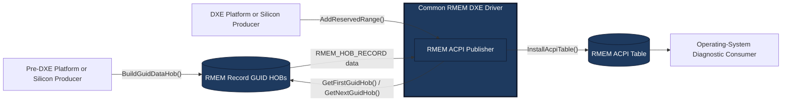

# Reserved-Memory Reporting through ACPI

Copyright (c) Microsoft Corporation.
SPDX-License-Identifier: BSD-2-Clause-Patent

## Status

Reserved-Memory Reporting (RMEM) Revision 1 is the Microsoft-recommended
firmware interface for silicon partners and OEMs to report reserved
physical-memory ranges on Windows devices. This document defines the `RMEM`
ACPI signature, wire format, category values, producer interfaces, validation
rules, and publication policy.

RMEM is defined by EDK II/Mu and is not currently an ACPI or UEFI industry
standard. Industry-standard designation would require approval by the
appropriate standards body and an official ACPI signature allocation.

## Motivation

Firmware can reserve physical memory for security services, device operation,
firmware runtime use, shared memory, crash handling, and other platform
functions. Operating systems generally report an aggregate hardware-reserved
amount without explaining the purpose of each range.

RMEM helps:

- Explain differences between installed and operating-system-visible memory.
- Diagnose unexpectedly large reservations.
- Compare firmware configurations across systems.
- Attribute reservations without a vendor-specific kernel-mode or user-mode
  driver.

## Goals

- Report the base address, size, purpose category, and diagnostic label for
  each authoritative reserved-memory range.
- Keep platform-specific discovery separate from common table construction.
- Support reservations known before DXE and reservations finalized during DXE.
- Publish one versioned, checksummed ACPI table.
- Avoid changing the system memory map or granting access to reported ranges.

## Non-Goals

- Defining ownership, access permissions, or security policy for a range.
- Replacing the UEFI memory map, ACPI resource descriptions, or existing
  architecture-specific reservation mechanisms.
- Allowing an operating system or application to access reported memory.
- Reporting device MMIO, uninstalled address space, alignment holes, or
  ordinary usable memory.
- Standardizing platform-specific discovery mechanisms.

## Architecture

Range discovery remains with platform and silicon modules. The common RMEM DXE
publisher owns validation, conflict handling, serialization, and ACPI table
installation.



A platform may use the pre-DXE path, the DXE path, or both. Each reservation
should have one owning producer and one transport path.

### Pre-DXE Producers

A producer creates one `RMEM_HOB_RECORD` GUID HOB for each static reservation
that is positively known before DXE. The producer must use an authoritative
reservation source. A gap in the UEFI memory map is not sufficient evidence
that a range is reserved DRAM.

The HOB record is defined in
`MdeModulePkg/Include/Guid/ReservedMemoryReportingHob.h`.

### DXE Producers

A DXE producer locates `EDKII_RMEM_REGISTRATION_PROTOCOL` and calls
`AddReservedRange()` for a reservation allocated, discovered, or finalized
during DXE. The publisher copies the label before returning.

The registration protocol is defined in
`MdeModulePkg/Include/Protocol/ReservedMemoryReporting.h`.

### Common Publisher

`RmemAcpiDxe` performs the following operations:

1. Imports and validates all RMEM GUID HOB instances.
2. Installs the DXE registration protocol.
3. Accepts registrations until `ReadyToBoot`.
4. Applies the same validation and conflict policy to both producer paths.
5. Freezes the entry set at `ReadyToBoot`.
6. Constructs, checksums, and installs one RMEM ACPI table.

## Revision 1 Table Layout

The Revision 1 table contains a standard 36-byte ACPI description header, a
2-byte entry count, a 2-byte entry offset, and zero or more packed 48-byte
entries.

```text
+----------------------+------------+-------------+----------+----------+----------+---------+----------+
| ACPI header          | EntryCount | EntryOffset | Base     | Size     | Category | Flags   | Label    |
| 36 bytes             | 2 bytes    | 2 bytes     | 8 bytes  | 8 bytes  | 2 bytes  | 2 bytes | 28 bytes |
+----------------------+------------+-------------+----------+----------+----------+---------+----------+
|<----------- table header: 40 bytes ----------->|<------------ each entry: 48 bytes ------------>|
```

For Revision 1, `EntryOffset` is 40 and the total table length is
`EntryOffset + (48 * EntryCount)` bytes.
The entry array therefore begins at an 8-byte-aligned offset from the table
base.

| Table offset | Size | Field | Description |
| ---: | ---: | --- | --- |
| 0 | 36 | `Header` | Standard ACPI description header |
| 36 | 2 | `EntryCount` | Number of entries following the header |
| 38 | 2 | `EntryOffset` | Byte offset from the table start to the first entry |
| 40 | `48 * EntryCount` | `Entries` | Packed array of RMEM entries |

Each entry has the following layout:

| Entry offset | Size | Field | Description |
| ---: | ---: | --- | --- |
| 0 | 8 | `Base` | First physical byte of the reserved range |
| 8 | 8 | `Size` | Range length in bytes |
| 16 | 2 | `Category` | Numeric purpose category |
| 18 | 2 | `Flags` | Entry attributes |
| 20 | 28 | `Label` | Null-terminated, zero-padded ASCII label |

The authoritative structure definitions are in
`MdeModulePkg/Include/Guid/ReservedMemoryReportingTable.h`.

## Categories

Revision 1 defines the following wire values:

| Value | Category | Intended use |
| ---: | --- | --- |
| 0 | Unknown | Invalid sentinel for missing or uninitialized values |
| 1 | Security | Isolated execution, security processors, or protected services |
| 2 | SharedMemory | Memory shared across firmware execution environments |
| 3 | DisplayFramebuffer | Pre-OS or persistent display framebuffer memory |
| 4 | GpuReserved | Memory reserved for graphics use |
| 5 | AiAcceleratorReserved | Memory reserved for AI acceleration |
| 6 | FirmwareRuntime | Runtime data, services, or crash diagnostics |
| 7 | Other | A reservation that does not fit another category |

`RmemCategoryMax` is an exclusive implementation bound and is not a valid wire
value. Producers must provide a category greater than `RmemCategoryUnknown` and
less than `RmemCategoryMax`.

## Flags

Revision 1 defines `RMEM_ENTRY_FLAG_ADDRESS_HIDDEN` in bit 0. When this flag is
clear, `Base` contains the first physical byte of the range. When this flag is
set, the serialized `Base` field must be zero and consumers must treat the
address as intentionally redacted.

Producers must provide the actual base address to the GUID HOB or registration
protocol even when the address is hidden. The publisher uses the actual address
for range and overlap validation and redacts it only when constructing the ACPI
table. All undefined flag bits must be zero.

## Validation and Conflict Policy

The publisher currently:

- Logs, asserts in debug builds, and skips HOBs with an unexpected payload
  size or invalid entry.
- Requires base addresses and sizes to be aligned to 4 KiB.
- Rejects zero-sized ranges, physical-address arithmetic overflow, and ranges
  beyond the address width reported by the CPU HOB.
- Does not start if the CPU HOB is missing or reports an invalid physical
  address width.
- Rejects unknown, maximum, and out-of-range categories.
- Rejects undefined flag bits.
- Rejects labels that are not null-terminated within the fixed label field.
- Rejects all overlaps, including exact duplicates.
- Applies overlap validation to actual addresses before redacting hidden
  addresses.
- Rejects registration after finalization.
- Limits the table to 64 entries.
- Continues publishing valid entries after rejecting an invalid registration.

Revision 1 producers and consumers must follow these policies to ensure
consistent validation and publication behavior.

## Security and Privacy

The table exposes physical addresses, sizes, categories, and labels to software
that can retrieve firmware tables. Producers must not include secrets, product
codenames, unique device information, or memory contents in a label.

Only authoritative firmware producers should register entries. Consumers must
treat the table as untrusted input and validate its signature, length, revision,
checksum, entry count, strings, and arithmetic before using it.

RMEM is diagnostic metadata. It does not grant access to a reported range and
must not be used as the sole source for access-control or memory-ownership
decisions.

## Windows PowerShell Retrieval

Windows exposes ACPI tables to user mode through `GetSystemFirmwareTable`. The
following PowerShell example retrieves the Revision 1 `RMEM` table, validates
its contents, compares its total with Windows' hardware-reserved memory, and
prints each decoded entry. The hardware-reserved value is calculated from the
Windows-reported physically installed memory minus the physical memory available
to the operating system. The script reads only system accounting and table
metadata and does not access the reported physical ranges.

```powershell
$ErrorActionPreference = "Stop"

if (-not ("RmemComparison.NativeMethods" -as [type])) {
  Add-Type -TypeDefinition @"
using System;
using System.Runtime.InteropServices;

namespace RmemComparison
{
  [StructLayout(LayoutKind.Sequential)]
  public struct MemoryStatusEx
  {
    public uint Length;
    public uint MemoryLoad;
    public ulong TotalPhysical;
    public ulong AvailablePhysical;
    public ulong TotalPageFile;
    public ulong AvailablePageFile;
    public ulong TotalVirtual;
    public ulong AvailableVirtual;
    public ulong AvailableExtendedVirtual;
  }

  public static class NativeMethods
  {
    [DllImport("kernel32.dll", SetLastError = true)]
    [return: MarshalAs(UnmanagedType.Bool)]
    public static extern bool GetPhysicallyInstalledSystemMemory(
      out ulong totalMemoryKilobytes);

    [DllImport("kernel32.dll", SetLastError = true)]
    [return: MarshalAs(UnmanagedType.Bool)]
    public static extern bool GlobalMemoryStatusEx(
      ref MemoryStatusEx buffer);

    [DllImport("kernel32.dll", SetLastError = true)]
    public static extern uint GetSystemFirmwareTable(
      uint providerSignature,
      uint tableId,
      IntPtr buffer,
      uint bufferSize);
  }
}
"@
}

function ConvertTo-ProviderSignature {
  param([Parameter(Mandatory)] [string]$Text)

  $bytes = [Text.Encoding]::ASCII.GetBytes($Text)
  ([uint32]$bytes[0] -shl 24) -bor
    ([uint32]$bytes[1] -shl 16) -bor
    ([uint32]$bytes[2] -shl 8) -bor
    [uint32]$bytes[3]
}

function ConvertTo-TableId {
  param([Parameter(Mandatory)] [string]$Text)

  [BitConverter]::ToUInt32([Text.Encoding]::ASCII.GetBytes($Text), 0)
}

function Format-ByteCount {
  param([Parameter(Mandatory)] [uint64]$Bytes)

  "{0:N3} MiB (0x{1:X})" -f ($Bytes / 1MB), $Bytes
}

function Resolve-RmemCategory {
  param([Parameter(Mandatory)] [uint16]$Value)

  switch ($Value) {
    1 { "Security" }
    2 { "SharedMemory" }
    3 { "DisplayFramebuffer" }
    4 { "GpuReserved" }
    5 { "AiAcceleratorReserved" }
    6 { "FirmwareRuntime" }
    7 { "Other" }
    default { "Unknown ($Value)" }
  }
}

function Add-UInt64Checked {
  param(
    [Parameter(Mandatory)] [uint64]$Left,
    [Parameter(Mandatory)] [uint64]$Right,
    [Parameter(Mandatory)] [string]$Description
  )

  if ($Left -gt ([uint64]::MaxValue - $Right)) {
    throw "$Description overflows UInt64."
  }

  $Left + $Right
}

[uint64]$installedKilobytes = 0
if (-not [RmemComparison.NativeMethods]::GetPhysicallyInstalledSystemMemory(
    [ref]$installedKilobytes)) {
  $errorCode = [Runtime.InteropServices.Marshal]::GetLastWin32Error()
  throw "GetPhysicallyInstalledSystemMemory failed (Win32 error $errorCode)."
}

if ($installedKilobytes -gt ([uint64]::MaxValue / 1KB)) {
  throw "The installed-memory byte count overflows UInt64."
}

$memoryStatus = [RmemComparison.MemoryStatusEx]::new()
$memoryStatus.Length = [Runtime.InteropServices.Marshal]::SizeOf(
  [type][RmemComparison.MemoryStatusEx])
if (-not [RmemComparison.NativeMethods]::GlobalMemoryStatusEx(
    [ref]$memoryStatus)) {
  $errorCode = [Runtime.InteropServices.Marshal]::GetLastWin32Error()
  throw "GlobalMemoryStatusEx failed (Win32 error $errorCode)."
}

[uint64]$installedBytes = $installedKilobytes * 1KB
[uint64]$windowsBytes = $memoryStatus.TotalPhysical
if ($installedBytes -lt $windowsBytes) {
  throw "Windows reports more usable memory than physically installed memory."
}

[uint64]$hardwareReservedBytes = $installedBytes - $windowsBytes

$provider = ConvertTo-ProviderSignature "ACPI"
$tableId = ConvertTo-TableId "RMEM"
$size = [RmemComparison.NativeMethods]::GetSystemFirmwareTable(
  $provider, $tableId, [IntPtr]::Zero, 0)

if ($size -eq 0) {
  throw "The currently booted firmware does not expose an RMEM ACPI table."
}

if ($size -gt [int]::MaxValue) {
  throw "The RMEM table is too large to retrieve safely."
}

$buffer = [Runtime.InteropServices.Marshal]::AllocHGlobal([int]$size)
try {
  $written = [RmemComparison.NativeMethods]::GetSystemFirmwareTable(
    $provider, $tableId, $buffer, $size)
  if ($written -eq 0) {
    $errorCode = [Runtime.InteropServices.Marshal]::GetLastWin32Error()
    throw "GetSystemFirmwareTable failed (Win32 error $errorCode)."
  }

  if ($written -ne $size) {
    throw "RMEM table size changed while reading: requested=$size written=$written."
  }

  $table = [byte[]]::new($written)
  [Runtime.InteropServices.Marshal]::Copy($buffer, $table, 0, [int]$written)
}
finally {
  [Runtime.InteropServices.Marshal]::FreeHGlobal($buffer)
}

$headerSize = 40
$entrySize = 48
if ($table.Length -lt $headerSize) {
  throw "RMEM table is shorter than its $headerSize-byte Revision 1 header."
}

$signature = [Text.Encoding]::ASCII.GetString($table, 0, 4)
$tableLength = [BitConverter]::ToUInt32($table, 4)
$revision = $table[8]
$entryCount = [BitConverter]::ToUInt16($table, 36)
$entryOffset = [BitConverter]::ToUInt16($table, 38)
$expectedLength = [uint64]$entryOffset + ([uint64]$entryCount * $entrySize)

if ($entryCount -gt 64) {
  throw "RMEM entry count $entryCount exceeds the Revision 1 limit of 64."
}

if (($signature -ne "RMEM") -or
    ($revision -ne 1) -or
    ($entryOffset -ne $headerSize) -or
    ($tableLength -ne $expectedLength) -or
    ($tableLength -ne $table.Length)) {
  throw "RMEM header is inconsistent: signature=$signature revision=$revision length=$tableLength entries=$entryCount entryOffset=$entryOffset."
}

$checksum = 0
foreach ($value in $table) {
  $checksum = ($checksum + $value) -band 0xFF
}

if ($checksum -ne 0) {
  throw "RMEM checksum is invalid."
}

$entries = @(for ($index = 0; $index -lt $entryCount; $index++) {
  $offset = $entryOffset + ($index * $entrySize)
  [uint64]$base = [BitConverter]::ToUInt64($table, $offset)
  [uint64]$rangeSize = [BitConverter]::ToUInt64($table, $offset + 8)
  [uint16]$category = [BitConverter]::ToUInt16($table, $offset + 16)
  [uint16]$flags = [BitConverter]::ToUInt16($table, $offset + 18)

  if (($category -lt 1) -or ($category -gt 7)) {
    throw "RMEM entry $index contains unsupported category $category."
  }

  if (($flags -band 0xFFFE) -ne 0) {
    throw "RMEM entry $index contains unsupported flags 0x$($flags.ToString('X4'))."
  }

  $addressHidden = ($flags -band 0x01) -ne 0
  if (($rangeSize -eq 0) -or
      (($base % 0x1000) -ne 0) -or
      (($rangeSize % 0x1000) -ne 0) -or
      ($addressHidden -and ($base -ne 0)) -or
      (-not $addressHidden -and
       ($base -gt ([uint64]::MaxValue - ($rangeSize - 1))))) {
    throw "RMEM entry $index contains an invalid physical range."
  }

  $labelBytes = $table[($offset + 20)..($offset + 47)]
  $terminator = [Array]::IndexOf($labelBytes, [byte]0)
  if ($terminator -lt 0) {
    throw "RMEM entry $index has no null-terminated label."
  }

  [pscustomobject]@{
    Index = $index
    Base = $base
    End = if ($addressHidden) {
      [decimal]0
    } else {
      [decimal]$base + [decimal]$rangeSize
    }
    Size = $rangeSize
    Category = Resolve-RmemCategory $category
    Flags = $flags
    AddressHidden = $addressHidden
    Label = [Text.Encoding]::ASCII.GetString($labelBytes, 0, $terminator)
  }
})

[uint64]$rawTotal = 0
[uint64]$visibleTotal = 0
[uint64]$hiddenTotal = 0
foreach ($entry in $entries) {
  $rawTotal = Add-UInt64Checked $rawTotal $entry.Size "RMEM total"
  if ($entry.AddressHidden) {
    $hiddenTotal = Add-UInt64Checked `
      $hiddenTotal $entry.Size "RMEM hidden total"
  } else {
    $visibleTotal = Add-UInt64Checked `
      $visibleTotal $entry.Size "RMEM visible total"
  }
}

$visibleEntries = @(
  $entries |
    Where-Object { -not $_.AddressHidden } |
    Sort-Object Base
)

for ($index = 1; $index -lt $visibleEntries.Count; $index++) {
  $previous = $visibleEntries[$index - 1]
  $current = $visibleEntries[$index]
  if ([decimal]$current.Base -lt $previous.End) {
    throw "RMEM entries $($previous.Index) and $($current.Index) overlap."
  }
}

[decimal]$difference =
  [decimal]$rawTotal - [decimal]$hardwareReservedBytes

Write-Host "Windows memory accounting"
Write-Host "  Physically installed : $(Format-ByteCount $installedBytes)"
Write-Host "  OS-usable physical   : $(Format-ByteCount $windowsBytes)"
Write-Host "  Hardware reserved    : $(Format-ByteCount $hardwareReservedBytes)"
Write-Host ""

Write-Host "RMEM accounting"
Write-Host "  Entries              : $entryCount"
Write-Host "  Visible entry total  : $(Format-ByteCount $visibleTotal)"
Write-Host "  Hidden entry total   : $(Format-ByteCount $hiddenTotal)"
Write-Host "  RMEM total           : $(Format-ByteCount $rawTotal)"
Write-Host ("  RMEM - Windows       : {0:N3} MiB" -f ($difference / 1MB))
Write-Host ""

if ($hiddenTotal -ne 0) {
  Write-Warning "Hidden entries are included by size, but their overlap cannot be independently checked."
}

Write-Warning "A nonzero RMEM - Windows difference may indicate missing RMEM coverage or a difference in reporting scope."

Write-Host ""
Write-Host "RMEM totals by category"
$entries |
  Group-Object Category |
  ForEach-Object {
    [uint64]$categoryTotal = 0
    foreach ($entry in $_.Group) {
      $categoryTotal = Add-UInt64Checked `
        $categoryTotal $entry.Size "RMEM category total"
    }

    [pscustomobject]@{
      Category = $_.Name
      Entries = $_.Count
      TotalMiB = [Math]::Round($categoryTotal / 1MB, 3)
    }
  } |
  Format-Table -AutoSize

Write-Host "RMEM entries"
$entries |
  Select-Object Index,
    @{Name = "Base"; Expression = {
      if ($_.AddressHidden) { "<hidden>" } else { "0x{0:X16}" -f $_.Base }
    }},
    @{Name = "SizeMiB"; Expression = { [Math]::Round($_.Size / 1MB, 3) }},
    Category,
    @{Name = "Flags"; Expression = { "0x{0:X4}" -f $_.Flags }},
    Label |
  Format-Table -AutoSize
```

### Expected PowerShell Output

The values below are illustrative. Actual addresses, sizes, categories, and
labels depend on the platform firmware and boot configuration.

```text
Windows memory accounting
  Physically installed : 8,192.000 MiB (0x200000000)
  OS-usable physical   : 7,408.000 MiB (0x1CF000000)
  Hardware reserved    : 784.000 MiB (0x31000000)

RMEM accounting
  Entries              : 4
  Visible entry total  : 529.000 MiB (0x21100000)
  Hidden entry total   : 255.000 MiB (0xFF00000)
  RMEM total           : 784.000 MiB (0x31000000)
  RMEM - Windows       : 0.000 MiB

RMEM totals by category
Category        Entries TotalMiB
--------        ------- --------
GpuReserved           1      512
Security              1      255
SharedMemory          1        1
FirmwareRuntime       1       16

RMEM entries
Index Base               SizeMiB Category        Flags Label
----- ----               ------- --------        ----- -----
  0 0x0000000010000000 512.000 GpuReserved     0x0000 iGPU Shared VRAM
  1 <hidden>            255.000 Security        0x0001 Security Processor
  2 0x000000003FF00000   1.000 SharedMemory    0x0000 MM Communication Buffer
  3 0x0000000040000000  16.000 FirmwareRuntime 0x0000 Offline Crash Dump
```

If the currently booted firmware does not publish RMEM, the script terminates
with an error similar to:

```text
The currently booted firmware does not expose an RMEM ACPI table.
```

Run the script from an ordinary PowerShell session after booting firmware that
publishes RMEM. If the table is absent, the script reports that the current
firmware does not expose it. Addresses, sizes, categories, and labels are
platform-specific diagnostic output.

## Platform Integration

To evaluate RMEM on a platform:

1. Add `MdeModulePkg/Universal/Acpi/RmemAcpiDxe/RmemAcpiDxe.inf` to the platform
   DSC and firmware-volume FDF.
2. Ensure `EFI_ACPI_TABLE_PROTOCOL` is available when the driver dispatches.
3. Create RMEM GUID HOBs for authoritative static reservations, register DXE
   reservations through the protocol, or use both paths.
4. Assign each reservation to one producer and avoid conflicting ranges.
5. Retrieve the resulting table through the operating system's supported ACPI
   table interface and validate it before decoding entries.
