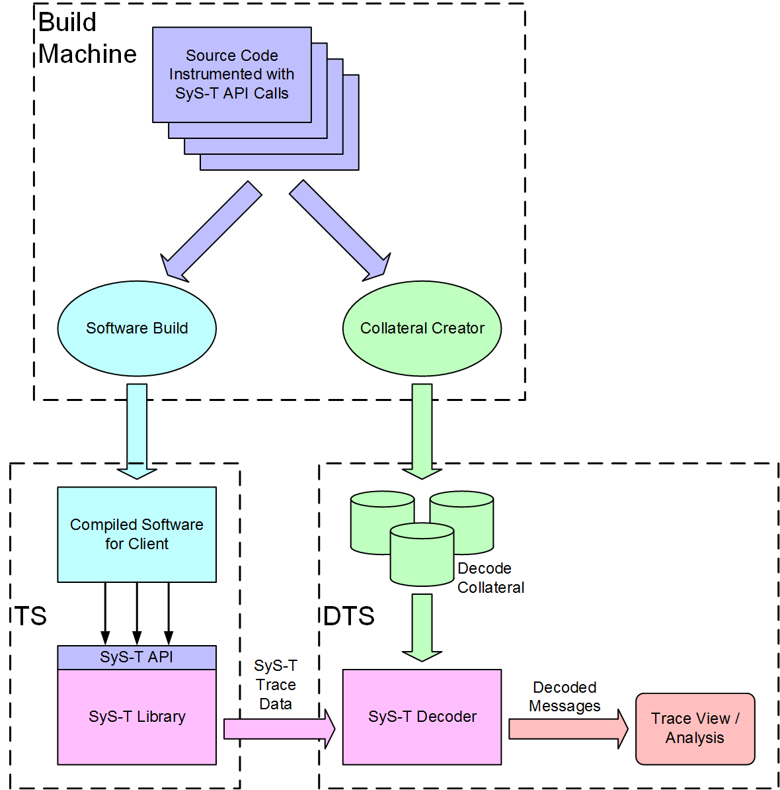

# MIPI System Software Trace (MIPI SyS-T) - Example Code #

The **MIPI Alliance Specification for System Software-Trace (MIPI SyS-T&#8480;**)
defines a platform-independent, low bandwidth trace data protocol and software
API for generating trace debug information from mobile or mobile influenced
devices.

This project provides an example implementation of a MIPI SyS-T
instrumentation library as its main component. The library exposes the
MIPI SyS-T API which generates the MIPI SyS-T data protocol.

The project includes the following additional components to provide a
working trace cross debug solution:

  * An example implementation for a MIPI SyS-T data protocol printer for
    converting the binary protocol into comma separated value (CSV)
    text format.
  * A PERL based collateral generator that automates the creation and
    updating of MIPI SyS-T decode collateral in XML format. The generator
    parses the catalog instrumentation calls inside the client source.
    It can be embedded into the software build process to keep builds
    and decode collateral updated at the same time.
  * Doxygen based documentation for the instrumentation library.
  * A unit test suite for the instrumentation library

## SyS-T Trace Debug Environment ##
SyS-T is intended for, but not limited to, cross-development environments
where two machines, named target system (TS) and debug test system (DTS),
exchange data over a transport layer. The TS uses the SyS-T library to generate
a trace data protocol that is sent via a transport to the DTS. The tool
stack on the DTS reads the data and decodes it into a format suitable for human
or automated analysis. The decode step utilizes collateral that
contains static trace data information like string to numeric key mappings. The
collateral is used to reduce both trace transport bandwidth and compiled
software space needs.



The  MIPI specification for SyS-T is available from the
[MIPI Alliance Website](https://mipi.org/specifications/sys-t).


## Supported Platforms ##

   * Windows
   * Mac OS X
   * Linux

## Requirements ##

The instrumentation library is designed to have minimal dependencies for
building. The library core is written using self-contained C-language code.
Only the platform dependent adaptation software layer relies on C-runtime
headers and libraries.

The protocol printer is written in C++11 and requires a C++11 compliant
compiler and runtime environment.

The following third party components are used for building the project:

  * [CMake](https://cmake.org/) for generating the platform dependent build system (required).
  * [Doxygen](http://www.stack.nl/~dimitri/doxygen/) for building the library documentation (optional).
  * [Google Test](https://github.com/google/googletest) for building the library unit tests (optional).
  * [PugiXML](https://github.com/zeux/pugixml) for building the printer project (required).

The Google Test and PugiXML components are configured as git modules
in the external folder of this project. If the folders are not populated,
run the following command to pull the required components from GitHub.
```
git submodule update --init --recursive
```
## Building ##
The project is split into the following sub projects.

| Project                          | Location    |
| ---------------------------------|-------------|
| SyS-T instrumentation library    | library     |
| Instrumented code examples       | examples    |
| SyS-T protocol printer tool      | printer     |
| Collateral generator tool        | collateral  |

The following chapters describe how to build the individual projects.

### Building the SyS-T Instrumentation Library ###
The instrumentation library uses the CMake build system. Building
the project follows the normal CMake flow. It requires an initial CMake run
to generate the platform dependent build system, for example Makefiles on
Linux or Visual Studio Projects on Windows. The native build tools are then
used to do the actual build. Note that CMake follows the "out of source"
build concept. That means that you create a build folder for CMake
projects outside of the source sandbox. All build artifacts are
created inside this build folder.

The CMake script for the instrumentation library uses the following
configuration switches:

| Option                           | Description |   Default Value |
| ---------------------------------|-------------|-----------------|
| CMAKE_INSTALL_PREFIX| Path prefix for the compiled library binaries and include files install location| (defined by CMake) |
| SYST_BUILD_PLATFORM_NAME|Name of the platform adaption code folder| example |
| SYST_BUILD_DOC|Enable build of Doxygen documentation| True if Doxygen installation was found, False otherwise |
| SYST_BUILD_GTEST_DIR|Installation location of Google Test sources. Set this for building the unit tests| (unset) |

The following transcript shows an example for configuring and building the
library on a Linux console. Replace "../sys-t/library" with the location of
your SyS-T project sandbox.

```
$ mkdir build
$ cd build
$ cmake ../sys-t/library -DCMAKE_INSTALL_PREFIX=../deploy -DSYST_BUILD_PLATFORM_NAME=example -DCMAKE_BUILD_TYPE=Release
(...)
-- Configuring done
-- Generating done
-- Build files have been written to: /users/mipi/prj/build

 $ make install
 (...)
 -- Installing: /users/mipi/prj/deploy/lib/libmipi_syst.so
 -- Installing: /users/mipi/prj/deploy/lib/libmipi_syst_static.a
 -- Installing: /users/mipi/prj/deploy/include
 $
```
The install target builds the projects and copies the libraries
and SyS-T header files to the deploy location. This location was defined
by the CMake variable ``CMAKE_INSTALL_PREFIX``. It forms a SyS-T SDK
that applications compile and link against.

If the unit tests are built as well, they can be run using one of the
following commands:

```bash
$ ctest -verbose
$ make RUN_TEST_VERBOSE
$ ./test/unit/syst_unittest
```

### Building the Example Applications ###
The project ships with example applications that show how to instrument
source code with the SyS-T API. The examples use the CMake build
system and require that the instrumentation library project was built and
installed first. The building depends on the SyS-T libraries and header
files in the install location. The location of the install folder needs
to be specified by setting the CMake variable ``SYST_SDK`` when configuring
the example project.

The following transcript shows the configuring and building of the examples
in a Linux console. Replace "../sys-t/examples" with the location of
your SyS-T sandbox examples folder and replace the value for SYST_SDK
with the location of the install location from a previously built
instrumentation library.


```
$ mkdir build_examples
$ cd build_examples
$ cmake ../sys-t/examples -DSYST_SDK=../deploy -DCMAKE_BUILD_TYPE=Release

-- Found SYST: /users/mipi/prj/deploy/include
-- Configuring done
-- Generating done
-- Build files have been written to: /users/mipi/prj/build_examples

$ make
Scanning dependencies of target hello
[ 20%] Building C object hello/CMakeFiles/hello.dir/hello.c.o
[ 40%] Linking C executable hello
[ 40%] Built target hello
Scanning dependencies of target systclient
[ 60%] Building C object client/CMakeFiles/systclient.dir/systclient.c.o
[ 80%] Building C object client/CMakeFiles/systclient.dir/othersource.c.o
[100%] Linking C executable systclient
[100%] Built target systclient
```

The examples code builds into standalone applications that can be run
directly from the console. To run the minimal hello example, enter the
following command:

```
$ hello/hello
  in SyS-T platform init hook: "mipi_syst_platform_state_init()"
                              systh = 0x6250c0, platform_data = (nil)
  in SyS-T platform handle init hook: systh = 0x1edd420

STP Protocol Output:
     0 <D32TS>  01801042
     1 <D64>    704caea243544e49
     2 <D64>    35ea9c9ea7d1b5ab
     3 <D64>    7953206f6c6c6548
     4 <D32>    21542d53
     5 <D8>     00
     6 <FLAG>
SYS-T RAW DATA: 42108001494E5443A2AE4C70ABB5D1A79E9CEA3548656C6C6F205379532D542100

  in SyS-T platform handle release hook:systh = 0x1edd420
$
```

The transcript shows the output from the example platform code in
the instrumentation library. The example platform code only prints
output actions to the console. It does not interface to any real
trace transport. The output shows the raw messages as hex dumps.
This output can be fed into the protocol printer tool to convert
it into human readable CSV textual data.

### Building the Data Protocol Printer ###
The project includes a SyS-T data protocol pretty printer tool
in the printer subdirectory. The printer is a standalone application
written in C++11. It supports reading the output from instrumented
applications using the example platform from the SyS-T
instrumentation library.
It scans the output for lines starting with ``SYS-T RAW DATA:`` and
converts the hex dumps into binary data for decoding. The printer can
be easily adapted to real trace data transports by replacing the code
in ``printer/src/mipi_syst_main.cpp`` with an appropriate data reader.

The following transcript shows how to build the printer on a Linux console.
The printer is a standalone application and independent from the
instrumentation or example projects.

```
$ cmake ../../sys-t/printer
-- The C compiler identification is GNU 5.4.0
-- The CXX compiler identification is GNU 5.4.0
-- Check for working C compiler: /usr/bin/cc
-- Check for working C compiler: /usr/bin/cc -- works
-- Detecting C compiler ABI info
-- Detecting C compiler ABI info - done
-- Detecting C compile features
-- Detecting C compile features - done
-- Check for working CXX compiler: /usr/bin/c++
-- Check for working CXX compiler: /usr/bin/c++ -- works
-- Detecting CXX compiler ABI info
-- Detecting CXX compiler ABI info - done
-- Detecting CXX compile features
-- Detecting CXX compile features - done
-- Configuring done
-- Generating done
-- Build files have been written to: /users/mipi/prj/syst_build/printer

$ make
Scanning dependencies of target systprint
[ 14%] Building CXX object CMakeFiles/systprint.dir/src/mipi_syst_main.cpp.o
[ 28%] Building CXX object CMakeFiles/systprint.dir/src/mipi_syst_collateral.cpp.o
[ 42%] Building CXX object CMakeFiles/systprint.dir/src/mipi_syst_printf.cpp.o
[ 57%] Building CXX object CMakeFiles/systprint.dir/src/mipi_syst_decode.cpp.o
[ 71%] Building CXX object CMakeFiles/systprint.dir/src/mipi_syst_message.cpp.o
[100%] Linking CXX executable systprint
[100%] Built target systprint
```

The printer project comes with a self test feature. The ``printer/test``
folder contains reference input and output files collected using the
``example/client`` example application. To run the printer test use the
following command (or the cmake test driver command ``ctest``) in the
printer build folder:

```
$ make test
Running tests...
Test project /users/mipi/prj/syst_build/printer
    Start 1: print_client_example
1/3 Test #1: print_client_example ...............   Passed    0.01 sec
    Start 2: diff_output_with_32bit_reference
2/3 Test #2: diff_output_with_32bit_reference ...   Passed    0.04 sec
    Start 3: diff_output_with_64bit_reference
3/3 Test #3: diff_output_with_64bit_reference ...   Passed    0.03 sec

100% tests passed, 0 tests failed out of 3

Total Test time (real) =   0.11 sec
```

To actually see the printer output, run the printer directly using command
line arguments, or indirectly through the test driver in verbose mode
(```ctest --verbose```). The following transcript shows how to call the
printer directly:

```
$systprint --short_guid {494E5443-8A9C-4014-A65A-2F36A36D96E4} --collateral ../../sys-t/printer/test/collateral.xml ../../sys-t/printer/test/input_client64.txt

Decode Status,Payload,Type,Severity,Origin,Unit,Message TimeStamp,Context TimeStamp,Location,Raw Length,Checksum,Collateral
OK,"0x0000000000010000 version banner string",BUILD:LONG,MAX,example,1,0x00054A4B376A70E9,0x0000000000000000,,62,0x4DDEF5B9,../../sys-t/printer/test/collateral.xml
OK,"SyS-T Library version 1.0.0",CATALOG:ID32P64,INFO,example,1,0x00054A4B376A70E9,0x0000000000000001,./systclient.c:64,48,0x7A34B527,../../sys-t/printer/test/collateral.xml
OK,"+-------------------------------------------------------+",CATALOG:ID32P64,INFO,example,1,0x00054A4B376A70E9,0x0000000000000002,./othersource.c:40,36,0x7CBB44B6,../../sys-t/printer/test/collateral.xml
OK,"|               ____         _____   _______            |",CATALOG:ID32P64,INFO,example,1,0x00054A4B376A70E9,0x0000000000000003,./othersource.c:41,36,0x2761EBF4,../../sys-t/printer/test/collateral.xml
OK,"|              / ___|       / ____| |__   __|           |",CATALOG:ID32P64,INFO,example,1,0x00054A4B376A70E9,0x0000000000000004,./othersource.c:42,36,0x55C63EAB,../../sys-t/printer/test/collateral.xml
OK,"|             | |___  __  _| |___ _____| |              |",CATALOG:ID32P64,INFO,example,1,0x00054A4B376A70E9,0x0000000000000005,./othersource.c:43,36,0xE3885FB4,../../sys-t/printer/test/collateral.xml
OK,"|              \___ \| | | |\___ \_____| |              |",CATALOG:ID32P64,INFO,example,1,0x00054A4B376A70E9,0x0000000000000006,./othersource.c:44,36,0x4C13A7F5,../../sys-t/printer/test/collateral.xml
OK,"|              ____| | |_| |____| |    | |              |",CATALOG:ID32P64,INFO,example,1,0x00054A4B376A70E9,0x0000000000000007,./othersource.c:45,36,0xE2C8BDC2,../../sys-t/printer/test/collateral.xml
OK,"|             |_____/ \__| |_____/     |_|              |",CATALOG:ID32P64,INFO,example,1,0x00054A4B376A70E9,0x0000000000000008,./othersource.c:46,36,0xD0734297,../../sys-t/printer/test/collateral.xml
OK,"|                      _/ /                             |",CATALOG:ID32P64,INFO,example,1,0x00054A4B376A70E9,0x0000000000000009,./othersource.c:47,36,0x6D704426,../../sys-t/printer/test/collateral.xml
OK,"|                     |__/                              |",CATALOG:ID32P64,INFO,example,1,0x00054A4B376A70E9,0x000000000000000A,./othersource.c:48,36,0x0A8FD609,../../sys-t/printer/test/collateral.xml
OK,"+-------------------------------------------------------+",CATALOG:ID32P64,INFO,example,1,0x00054A4B376A70E9,0x000000000000000B,./othersource.c:49,36,0x1E99CD8F,../../sys-t/printer/test/collateral.xml
OK,"|    catalog Format  |         Printed Result           |",CATALOG:ID32P64,INFO,example,1,0x00054A4B376A70E9,0x000000000000000C,./othersource.c:231,36,0xA17B5C1C,../../sys-t/printer/test/collateral.xml
OK,"|---------------------------------strings---------------|",CATALOG:ID32P64,INFO,example,1,0x00054A4B376A74D1,0x000000000000000D,./othersource.c:232,36,0x11A215E6,../../sys-t/printer/test
(...)
$
```
## Decode Collateral Creation Tool ##
The project includes a PERL based collateral generator that automates the
creation and updating of SyS-T decode collateral in XML format. This
generator parses the catalog instrumentation points by scanning the
client source code. The tool can be embedded into a software build process to
keep software builds and decode collateral updated at the same time. The tool
is stored in the ```collateral\generator``` folder of the project with the
name ```syst_cgen.pl```.

### Dependencies ###
The generator is written in PERL and requires a PERL installation with the
following optional modules installed.
 * String::Escape
 * Xml::Simple

Refer to the documentation for your PERL installation on module installation.
On Linux, the following commands can be used:

```
$ perl -MCPAN -e 'install XML::Simple'
$ perl -MCPAN -e 'install String::Escape'
```

### Collateral Generation Process ###
The collateral generator takes a SyS-T collateral template and
a configuration file as input. The configuration file defines the locations
and file extensions of the source files to be scanned and how the catalog
message calls
inside the source code are named. The tool can then detect the catalog
calls, and extracts the format strings, source locations, and
catalog IDs to update the collateral template file. The result is a
new collateral file that matches the actual state of the source code.

### Catalog Generation Example ###
The client application in ```example/client``` uses various catalog calls.
It therefore provides a configuration file for```syst_cgen.pl``` to detect
the SyS-T catalog message calls, and a collateral template file that is
updated by the generator. It is executed in the following way:

```
$ perl ../../collateral/generator/syst_cgen.pl -config collateral_config.xml
syst_catgen.pl: Parsing: ./othersource.c
syst_catgen.pl: Add ./othersource.c with file id 1 to file catalog
syst_catgen.pl: Parsing finished: ./othersource.c, found 127 call(s)
syst_catgen.pl: Parsing: ./systclient.c
syst_catgen.pl: Add ./systclient.c with file id 2 to file catalog
syst_catgen.pl: Parsing finished: ./systclient.c, found 4 call(s)
syst_catgen.pl: Generating XML structure
syst_catgen.pl: Loaded template collateral file template.xml
syst_catgen.pl: Generating XML structure finished
syst_catgen.pl: Writing XML file: generated_catalog.xml
syst_catgen.pl: Writing XML file finished
```

This call creates the file ``generated_catalog.xml``. It is used by
SyS-T data protocol processing tools to decode the catalog messages
from this application. For an example of such an application, see the
earlier section about the protocol printer. The printer tool uses the
``--collateral <file>`` argument to load collateral files.

## Integration Build Test ##
The bash script in ``examples/scripts/bldall.sh`` can be used to run an
integration test for the different projects. The script builds all projects
sequentially using the example library platform. It then runs components
tests and finally calls the printer tool to format the output of
the ``hello`` example application. The following transcript shows how to
run execute the script. The BLD_ROOT variable sets the location of the build
folder. If unset, the script creates a local build folder in the scripts
folder.

```
$ cd sys-t/examples/scripts
$ BLD_ROOT=/tmp/sys_t_test_bld ./bldall.sh
```

## License

See [LICENSE](LICENSE)
