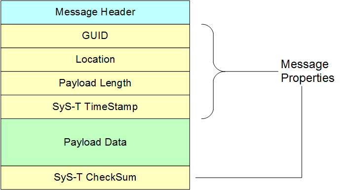
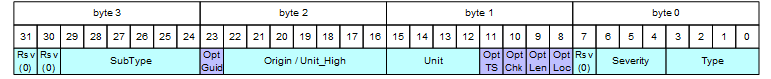

\page mipi_syst_decoder_protocol SyS-T Data Protocol

[TOC]

Overview {#syst_decoder_prot_overview}
==============================================================================
The SyS-T Data Protocol is a byte sequence that represents a list of variable
length SyS-T Messages without additional padding bytes between them. The
SyS-T Data Protocol is intended for transmission over a lower level transport
protocol. The lower level protocol is expected to provide indicators that
identify the start and end of a SyS-T Message. One example of a lower level
transport protocol is the
[MIPI System Trace Protocol](http://mipi.org/specifications/debug#STP) (STP).
SyS-T includes message frame definitions that provides time stamping
and framing of a SyS-T Message based on STP packet types. The usage of
other lower level transports protocols is possible by adapting the message
writer or low level trace output functions from the platform level code.

The SyS-T Data Protocol includes various optional fields for ensuring data
integrity or time stamping. Depending on the capabilities of the lower level
protocol, these SyS-T Message fields may be redundant and so be omitted to
save trace bandwidth.

Data Field Byte Ordering {#syst_decoder_prot_byteorder}
------------------------------------------------------------------------------
All numeric data fields of the SyS-T Data Protocol follow little-endian byte
ordering where less significant bytes precede more significant ones. Only the
optional 128-bit Guid field is an exception to this rule. Its byte odering
follows RFC 4122 which defines Guid fields following big-endian ordering.

MIPI STPv2 Protocol Encoding {#syst_decoder_prot_format}
------------------------------------------------------------------------------
In order to timestamp packets and to give an indication of a valid SyS-T
Message beginning and end, each SyS-T Message starts with a
TIMESTAMPED STP data packet and ends with either a FLAG packet or a
MARKED data packet.
For environments that can only afford light weight value style traces, a
short message encoding is also available. This encoding uses a single IO to
generate an STP packet that is both MARKED and TIMESTAMPED. The following
table shows the supported STP packet sequences for a SyS-T Message. Dn means
either a D8, D16, D32 or D64 data packet.
The Dn* stands for a sequence of 0-x repeated Dn packets (of any sizes). Dn
packets with a smaller payload size can be combined into a Dn with a larger
size to reduce the number of IO's. For example, two D16 IO's can be combined
into a single D32 as long as the resulting binary payload data produces the
same result when being copied into memory.

  MIPI STPv2 Sequences     |  Description
---------------------------|--------------------------------------------
DnMTS                      |Single IO short message with Dn sized payload. This message is intended for numeric value only tracing.
DnTS-Dn*-DnM               |Arbitrary length sequence starting with a time stamped data value and followed by a sequence of zero or more payload data values. The last data value is MARKED to indicate the end of the sequence.
DnTS-Dn*-FLAG              |Arbitrary length sequence starting with time stamped data value and followed by a sequence of zero or more payload data values. The sequence is terminated with a FLAG packet.

The reason for supporting sequences terminated with either a MARKED or a
FLAG packet is to simplify the implementation for SW and HW trace generators.
HW based generates may prefer the MARKED method to save additional logic for
issuing a FLAG. SW trace generators may prefer the FLAG variant as it
avoids special handling for the last Dn.

Message Anatomy {#syst_decoder_prot_anatomy}
------------------------------------------------------------------------------
A SyS-T Message is a byte sequence that starts with a 32-bit header, followed by
mandatory and optional data attributes. The following picture shows the layout
of a SyS-T Message with all fields present.

The message fields are:
 - A 32-bit [header] (#syst_decoder_prot_header) describing the message type and content
 - An optional 128-bit wide [GUID] (#syst_decoder_prot_guid) identifying the message originating software module.
 - An optional [location record] (#syst_decoder_prot_location)
 - An optional [payload length] (#syst_decoder_prot_length)
 - An optional [SyS-T timestamp] (#syst_prot_timestamp)
 - API specific [payload data] (#syst_decoder_prot_payload) from zero up to 64 Kbytes.
 - An optional CRC-32C [checksum] (#syst_decoder_prot_checksum)

Attributes are stored one after the other without any additional alignment bytes.

SyS-T Protocol Overhead {#syst_decoder_prot_overhead}
------------------------------------------------------------------------------
The typical data overhead of the SyS-T Data Protocol is 4 bytes (32 bits) per
message unless optional elements like CRC32 checksums are enabled.
These 4 bytes come from the 32-bit message header at the beginning
of each message.

In addition to the typical usage as a message trace, SyS-T protocol offers also
the following protocol types for small value or bulk data transfer support:

 - Single value onle traces can utilize SHORT messages. These provide a
   zero data overhead method on STP hardware using single DnMTS
   packets to hold the data.
 - SyS-T raw messages can be used to stream up to 64 Kbytes of payload data
   in a single SyS-T Message to tunnel another Data Protocol through SyS-T.

Data Protocol Details {#syst_decoder_prot_details}
==============================================================================

Header {#syst_decoder_prot_header}
------------------------------------------------------------------------------
A SyS-T header is 32-bit value using the following layout:

The meaning of the individual fields is explained in the table below.

Field   |Bits  |Description
--------|------|-----------------------------------------------------
RES31   |31..31|Reserved, Must be set to zero.
RES30   |30..30|Reserved, Must be set to zero.
SUBTYPE |24..29|Additional message type information that depends on TYPE.
GUID    |23..23|Indicates whether the optional GUID is present
ORIGIN  |12..22|message origin and/or unit information
TS      |11..11|Indicates whether the optional message time stamp is present.
CHK     |10..10|Indicates whether the optional Checksum is present at the end.
LEN     |9..9  |Indicates whether the optional Payload length is present.
LOC     |8..8  |Indicates whether the optional Location Record field is present.
RES7    |7..7  |Reserved, Must be set to zero.
SEVERITY|4..6  |Severity level of the message.
TYPE    |0..3  |Message type

C-Definition (struct mipi_syst_msg_tag):
\code{.cpp}
struct mipi_syst_msg_tag {
     mipi_syst_u32 et_type:4;     /**< SyS-T message type ID            */
     mipi_syst_u32 et_severity:3; /**< severity level of message        */
     mipi_syst_u32 et_res7:1;     /**< reserved for future use          */
     mipi_syst_u32 et_location:1; /**< indicate location information    */
     mipi_syst_u32 et_length:1;   /**< indicate variable length message */
     mipi_syst_u32 et_chksum:1;   /**< indicate 32bit CRC               */
     mipi_syst_u32 et_timestamp:1;/**< indicate 64 bit timestamp        */
     mipi_syst_u32 et_modunit:11; /**< unit for GUID or module:unit     */
     mipi_syst_u32 et_guid:1;     /**< 128 bit GUID present             */
     mipi_syst_u32 et_subtype:6;  /**< type dependent sub category      */
     mipi_syst_u32 et_res30:1;    /**< reserved for future use          */
     mipi_syst_u32 et_res31:1;    /**< reserved for future use          */
};
\endcode

Severity {#syst_decoder_prot_header_severity}
------------------------------------------------------------------------------

An optional severity level is assigned to a SyS-T Message to distinguish
informational messages from warnings and errors. Severity levels are used
for message classification and filtering. The severity levels are ordered
by ascending numerical values.

Severity                   |Value  | Description
---------------------------|:-----:|----------------------------------------------
MIPI_SYST_SEVERITY_MAX     | 0     |No assigned severity. This is used for messages that should bypass filtering. This is typically used with RAW message that tunnel other protocols over SyS-T Messages.
MIPI_SYST_SEVERITY_FATAL   | 1     |Indicates a fatal level message. Such messages provide information about a failure condition from which the system cannot recover or cannot continue to function properly.
MIPI_SYST_SEVERITY_ERROR   | 2     |Indicates an error level message. Such messages provide information about an operation failure or inappropriate action that the system is not designed to handle. Errors may or may not cause a feature or system to subsequently fail.
MIPI_SYST_SEVERITY_WARNING | 3     |Indicates a warning level message. Such messages provide information about an undesirable, but recoverable situation that may result in problems if no actions are taken. Warning message information can be utilized to adaptively adjust system operations to avoid failures or to improve performance based on the use case.
MIPI_SYST_SEVERITY_INFO    | 4     |Indicates an information level message. Such messages provide component specific information about operational actions and progress. They are intended for component specialists to analyze system behavior.
MIPI_SYST_SEVERITY_USER1   | 5     |Indicates a first user-defined message level for information with a higher verbosity than MIPI_SYST_SEVERITY_INFO. They are intended for component specialists to analyze system behavior in greater detail.
MIPI_SYST_SEVERITY_USER2   | 6     |Indicates a second user-defined level for informational messages with a higher verbosity than MIPI_SYST_SEVERITY_USER1. They are intended for component specialists to analyze system behavior in even greater detail.
MIPI_SYST_SEVERITY_DEBUG   | 7     |Indicate a debug level message. Such messages provide information that is intended for system developers for detailed analysis and debug of system behavior. It provides the finest granularity of trace information and is typically used during verification and debug phases.

Message Origin or GUID {#syst_decoder_prot_guid}
------------------------------------------------------------------------------
A SyS-T Message may contain a 128-bit wide GUID to identify the instrumented
software module in a unique way. A GUID is used if the guid bit in the header
is set. Otherwise the header origin field defines the message origin,
saving the bandwidth and space that would be used for the additional GUID bits.

Omitting the GUID is possible when the origin field or transport layer
information sufficiently identifies the trace emitting source. An example
for transport layer information are the Master and Channel pairs for transports
using MIPI System Trace Protocol. If the message was sent from a dynamically
assigned master and channel pool, then these values are not sufficient and a
GUID must be used to describe the origin. If the handle got initialized using
the #MIPI_SYST_SET_HANDLE_GUID_UNIT API then the GUID is emitted directly after
the header in each message.
Note:
The GUID structure follows https://www.ietf.org/rfc/rfc4122.txt.

Location {#syst_decoder_prot_location}
------------------------------------------------------------------------------

A SyS-T Message can contain location information describing the position of
its instrumentation call either as an instruction pointer address or as a
"file:line" ID pair. This location information is generated if one of the
API variants with the `_LOCADDR`, `_LOC16` or `_LOC32` suffix in the name is
used.

### C Definition of Location ###

\code{.cpp}
/**
 * Specify format of used message location information that is added to the
 * message data if tag.et_location == 1
 */
struct mipi_syst_msglocation {
    /** Message format
     * 0 = 16-Bit file and 16-Bit line (total: 32-bit)
     * 1 = 32-Bit file and 32-Bit line (total: 64-bit)
     * 2 = 32-bit code address
     * 3 = 64-bit code address
     */
    mipi_syst_u8 el_format;
    union {
        union mipi_syst_msglocation32 loc32; /**< data for 32-bit variant  */
        union mipi_syst_msglocation64 loc64; /**< data for 64-bit variant  */
    } el_u;
};

/**
 * Location information inside a message (32-bit format)
 * Location is either the source position of the instrumentation call, or
 * the call instruction pointer value.
 */
union mipi_syst_msglocation32 {
    struct {
        mipi_syst_u16 etls_fileID; /**< ID of instrumented file   */
        mipi_syst_u16 etls_lineNo; /**< line number in file       */
    } etls_source_location;
    mipi_syst_u32 etls_code_location:32;
    /**< instruction pointer value */
};

/**
 * Location information inside a message (64-bit format)
 * Location is either the source position of the instrumentation call, or
 * the call instruction pointer value.
 */
union mipi_syst_msglocation64 {
    struct {
        mipi_syst_u32 etls_fileID; /**< ID of instrumented file   */
        mipi_syst_u32 etls_lineNo; /**< line number in file       */
    } etls_source_location;
    mipi_syst_u64 etls_code_location:64;
    /**< instruction pointer value */
};

\endcode

Length {#syst_decoder_prot_length}
------------------------------------------------------------------------------

The location information is followed by a 16-bit length field if  the header bit
et_length is set. This length indicates the number of message payload bytes that
follow.

### C Definition of Length ###

\code{.cpp}
    syst_u16_t ed_len;
\endcode

Message Payload {#syst_decoder_prot_payload}
------------------------------------------------------------------------------
A SyS-T Message can contain a type specific payload of up to 64 Kbytes. The payload
appears after the optional message fields, but before the optional checksum.

Checksum {#syst_decoder_prot_checksum}
------------------------------------------------------------------------------
A SyS-T Message can end with a 32-bit CRC-32C checksum calculated over all of
the message bytes, excluding the checksum value itself. The CRC generation is
a per SyS-T handle choice. It is enabled or disabled by the
#MIPI_SYST_ENABLE_HANDLE_CHECKSUM API. The default is disabled.

Protocol Timestamp Handling  {#syst_prot_timestamp}
==============================================================================
The default usage for the SyS-T protocol is to rely on a transport timestamp
generated by, for example, trace arbiter hardware or a trace creating driver.
In this case, a SyS-T Message does not carry its own timestamp information. In
scenarios where no hardware time stamp exists, or this timestamp is not
accurate, SyS-T Messages can include their own time stamp. An example scenario
for this is when messages are buffered by a trace source before they are sent.
In this case, the hardware time stamp will reflect a later message submission
time, not the message creation time, which is typically what is desired.

Clock Synchronization {#syst_prot_timestamp_sync}
------------------------------------------------------------------------------
The SyS-T protocol facilitates correlating messages that use a time stamp of
their own with the trace timestamp of the underlying transport protocol. This
correlation is done using a synchronisation message, which contains both the
transport protocol timestamp and the source clock value and frequency from
the SyS-T message clock.

These data values build a time correlation point between the transport
clock and the SyS-T message clock. If MIPI STP is the transport protocol then
the D32TS header time stamp will define the transport time stamp. The message
is expected to be sent periodically from any source that requires time
synchronisation with the transport protocol. Host side tooling needs at least
one of these records in a trace stream to do the time correlation. Typically
these synchronization messages are sent either periodically, such as once
every second, or at the beginning of trace emitting phases.

SyS-T Messages Types {#syst_decoder_prot_msg_types}
==============================================================================
This chapter shows the major SyS-T message types.
The type can be one of the following (See [C Definition] (@ref mipi_syst_msgtype) ):

Value   |SyS-T Name               |Description
--------|-------------------------|-------------------------------------
0       |MIPI_SYST_TYPE_BUILD     |SyS-T client build version information
1       |MIPI_SYST_TYPE_SHORT32   |32 Bit message with user defined payload value
2       |MIPI_SYST_TYPE_STRING    |Text message output for UTF-8 encoded strings
3       |MIPI_SYST_TYPE_CATALOG   |Catalog message output support formatting string with parameters
4,5     |RESERVED-FOR-FUTURE-USE  |Reserved
6       |MIPI_SYST_TYPE_RAW       |Raw binary payload
7       |MIPI_SYST_TYPE_SHORT64   |64 Bit message with user defined payload value
8       |MIPI_SYST_TYPE_CLOCK     |Timing synchronization
9..15   |RESERVED-FOR-FUTURE-USE  |Reserved

For further information on the different message type contents, read chapter 8
in the MIPI Alliance Specification for System Software-Trace (SyS-T).
