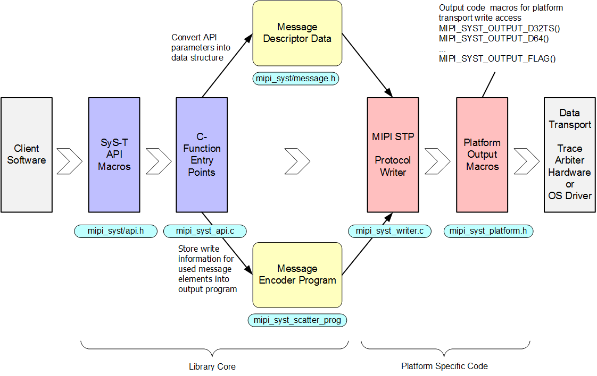

MIPI SyS-T Instrumentation Library  {#mipi_syst_mainpage}
==============================================================================

About the SyS-T instrumentation library
==============================================================================
The MIPI System Software Trace (SyS-T) library is a customizable, low
overhead example implementation of the SyS-T API and data protocol described
here:
https://www.mipi.org/specifications/sys-t

The library is written as a self-contained C-language module and does not
depend on other runtime library or system include files. The SyS-T library is
usable in very different software environments, including OS user mode code, OS
kernel mode code, or controller firmware.

This library provides the SyS-T instrumentation API to other software
components. The SyS-T API calls generate the @ref mipi_syst_decoder_protocol
and typically write it to a trace aggregator for bundling the data with other
trace sources. The SyS-T API offers advanced trace capabilities, such as:

* String formatting in C-language printf style
* Catalog messages to save data size and trace I/O bandwidth
* Tunnelling of other data protocols
* Hardware and Software provided message time stamping and synchronisation

The following picture shows the library execution flow left to
right. The SyS-T API is a set of preprocessor macros that are calling library
functions for generating trace messages based on the API input parameters.
These parameters are encoded into an internal format and written out by
platform specific code to the systems trace transport layer.

Documentation for using SyS-T to instrument software
==============================================================================
 - [Instrumentation API Overview](@ref mipi_syst_api_overview)
 - [API Quick Reference](@ref mipi_syst_api_page)
 - [API Sets](@ref ApiSets)

Click here for a minimal "Hello World" style example of
a SyS-T instrumented application: @ref mipi_syst_example_page

Documentation for building and integrating SyS-T
==============================================================================
- [Building the SyS-T Library](@ref mipi_syst_building_page)
- [Adapting the SyS-T Library](@ref mipi_syst_adapting_page)
- [Automated Collateral Generation](@ref mipi_syst_catgen_page)
- [Decoding and printing the SyS-T data protocol] (@ref mipi_syst_printer_page)

SyS-T License
==============================================================================
The SyS-T library code is Copyright (c) MIPI Alliance, Inc. and distributed
under a permissive open source license. The detailed license information can
be found [here](@ref mipi_syst_license_page).
