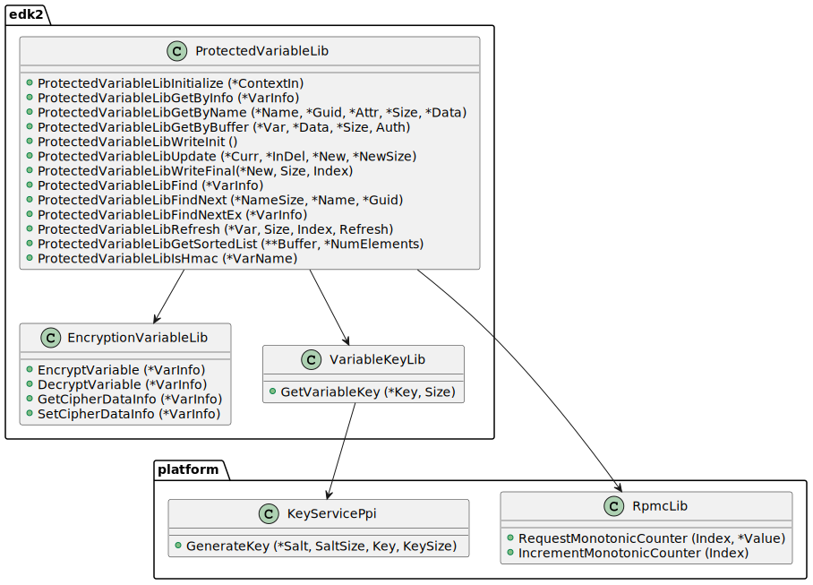
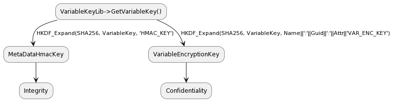
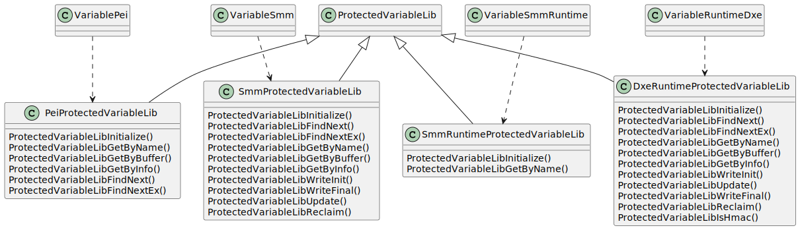
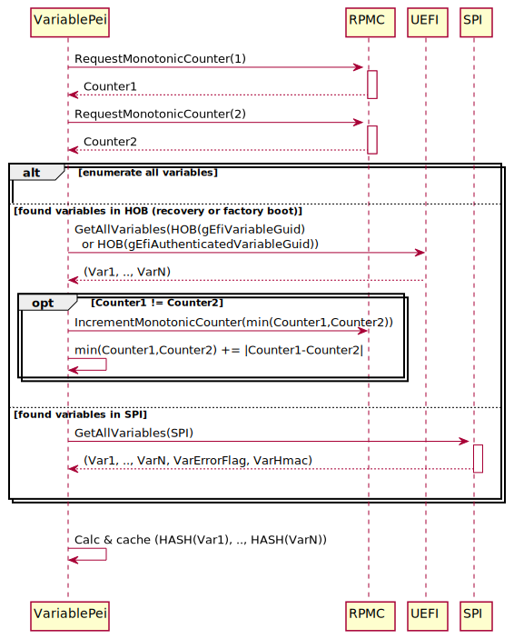
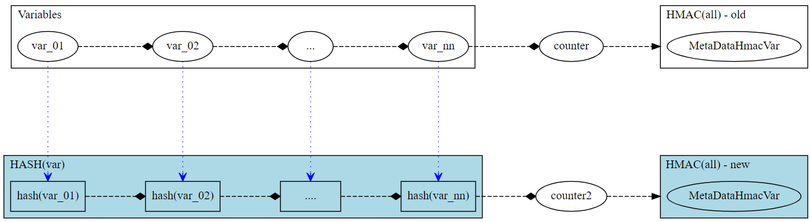
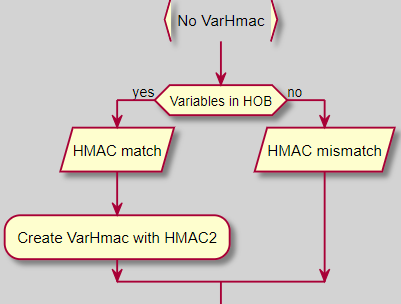
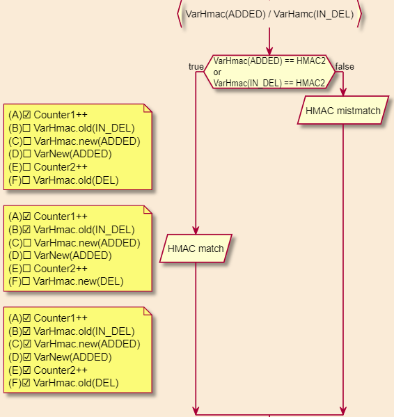
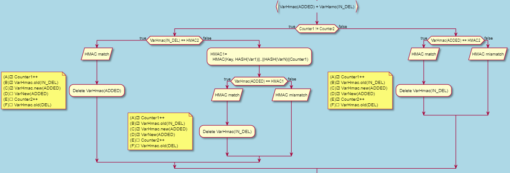

# Variable Integrity and Confidentiality with RPMC

This staging branch introduces new features, integrity and confidentiality with RPMC (Replay Protected Monotonic Counter), into current variable services. Since this is a big add-on, a separate branch can help users to review, evaluate and/or test the new functionalities and potential backward compatibility issues.

## Requirement

From Microsoft Windows 10 [1903](https://go.microsoft.com/fwlink/?linkid=2086856)

```plaintext
“Confidential & replay-protected storage [Optional until 2020]: External memory for non-volatile storage of all UEFI variables and security-sensitive BIOS settings MUST include protections of that data to insure confidentiality and integrity of the data and to mitigate against rollback attacks. This is generally accomplished by encrypting the data, Confidential & replay-protected storage. This is generally accomplished by encrypting the data, applying a Message Authentication Code, and storing the resulting record in replay-protected storage such as Replay Protected Memory Block or Replay Protected Monotonic Counter.”
```

## Architecture

The main functionalities of integrity and confidentiality are provided through [ProtectedVariableLib](https://github.com/judahvang/edk2-1/blob/rpmc-update/MdeModulePkg/Include/Library/ProtectedVariableLib.h) library, which employs [EncryptionVariableLib](https://github.com/judahvang/edk2-1/blob/rpmc-update/MdeModulePkg/Include/Library/EncryptionVariableLib.h) to do encryption/description works, [RpmcLib](https://github.com/judahvang/edk2-1/blob/rpmc-update/SecurityPkg/Include/Library/RpmcLib.h) to operate Replay Protected Monotonic Counter for replay protection, and [VariableKeyLib](https://github.com/judahvang/edk2-1/blob/rpmc-update/SecurityPkg/Include/Library/VariableKeyLib.h) to access hardware generated root key for integrity check and data encryption for variables.



[RpmcLib](https://github.com/judahvang/edk2-1/blob/rpmc-update/SecurityPkg/Include/Library/RpmcLib.h) and [VariableKeyLib](https://github.com/judahvang/edk2-1/blob/rpmc-update/SecurityPkg/Include/Library/VariableKeyLib.h) rely on platform to provide related functionalities and then should be instantiated by platform. Edk2 only provides null version of instances ([RpmcLibNull](https://github.com/judahvang/edk2-1/tree/rpmc-update/SecurityPkg/Library/RpmcLibNull) and [VariableKeyLibNull](https://github.com/judahvang/edk2-1/tree/rpmc-update/SecurityPkg/Library/VariableKeyLibNull)) for build purpose. Don't use them in real product.

ProtectedVariableLib will use the key got from VariableKeyLib to derive two keys:

- MetaDataHmacKey, for variable integrity check via HMAC algorithm;
- VariableEncryptionKey, for variable encryption/decryption.



Edk2 provides an instance of [EncryptionVariableLib](https://github.com/judahvang/edk2-1/tree/rpmc-update/SecurityPkg/Library/EncryptionVariableLib), which uses AES-CBC algorithm to encrypt/decrypt variable data. A null version [EncryptionVariableLib](https://github.com/judahvang/edk2-1/tree/rpmc-update/SecurityPkg/Library/EncryptionVariableLibNull) can be used to disable the encryption/decryption functionality. This is for those who just want integrity check for variables.

Edk2 provides four instances of ProtectedVariableLib to support variable services in different environment:

- [PeiProtectedVariableLib](https://github.com/judahvang/edk2-1/tree/rpmc-update/SecurityPkg/Library/ProtectedVariableLib), for PEI variable services
  - Derive MetaDataHmacKey from platform VariableKey
  - Cache all variables and verify their integrity before accessing any variable data, based on current RPMC value
  - Read variable data, after decrypted, if encrypted
  - Pass on all keys and verified variable data via HOB to SMM
- [SmmProtectedVariableLib](https://github.com/judahvang/edk2-1/tree/rpmc-update/SecurityPkg/Library/ProtectedVariableLib), for SMM variable services
  - Derive VariableEncryptionKey from VariableKey
  - Read decrypted variable data from cache
  - Write encrypted variable data to flash
  - Refresh HMAC and update MetaDataHmacVar variable with its value, upon updating any other variable
  - Advance RPMC before the first variable update operation
  - Advance RPMC after any variable update operation
- [SmmRuntimeProtectedVariableLib](https://github.com/judahvang/edk2-1/tree/rpmc-update/SecurityPkg/Library/ProtectedVariableLib), for RuntimeService variable interfaces
  - Read decrypted variable data from cache
  - Pass variable write operation onto SMM
- [DxeProtectedVariableLib](https://github.com/judahvang/edk2-1/tree/rpmc-update/SecurityPkg/Library/ProtectedVariableLib), for emulation environment only
  - Similar to SmmProtectionVariableLib



There're two special variables which must not be encrypted or taken into integrity check:
- L"MetaDataHmacVar“ (gEdkiiMetaDataHmacVariableGuid)
  - Store the HMAC value for integrity check
- L"VarErrorFlag" (gEdkiiVarErrorFlagGuid)
  - Record error status when out of resource

## Workflow

- PEI variable services initialization flow
  - At the beginning of initialization, the variable PEIM retrieves current value of both counters for later uses. Normally Counter1 should be the same as Counter2. But it is allowed to be one step ahead Counter2 due to reversible operation failures occurred in the middle of writing a protected variable. All other cases is considered as variable integrity compromise, unless it's in the variable recovery process or factory boot process.
  - If GUID-ed HOB (gEfiVariableGuid or gEfiAuthenticatedVariableGuid) is found during initialization, it's considered as variable recovery process (due to compromised variable found in last boot) or factory boot process (due to default variable provisioning). In such case, all variables on NV storage are considered as invalid and must be abandoned. In addition, the variable PEIM must make sure that the value of Counter1 and Counter2 is the same before proceed. This can be achieved by requesting "increment" operation to counter with smaller value until it becomes the same as another one.
  - If there's no variables in HOB, the variable PEIM tries to enumerate all variables from NV storage.
  - During the NV variables enumeration, the variable PEIM calculates hash value (the same hash algorithm used by HMAC) for each variable and cache all hash values for later uses.
- 
  - Then the variable PEIM retrieves RootKey from platform (via KeyServicePpi interface), and derive MetaDataHmacKey and/or VariableEncryptionKey from it with HKDF_Expand algorithm. Note that RootKey has a history list. If the latest one failed the variable integrity check, the driver must retrieve the old one, re-derive MetaDataHmacKey and/or VariableEncryptionKey from it, and re-validate all variables integrity against it, until the integrity check passes or no more RootKeys are available.
- The HMAC value is calculated based on data produced by concatenating the hash value of each variable (note the algorithm used in old implementation is concatenating the variable data). The RPMC counter value is concatenated as the last part data. Note this version of implementation is using two RPMC counters.
  - 
- MetaDataHmacVar must exist if variables on NV storage are valid (no variable HOB). Otherwise it's considered as integrity validation failure, and variable recovery process should be triggered (depends on platform policy) to recover NV variable storage to its certain state. If variable HOB exists, no integrity check is performed. MetaDataHmacVar is created with HMAC value calculated against Counter2, but won't be written to NV storage until variable write service is available (due to security consideration, variable can only be written in SMM mode).
  - 
- If MetaDataHmacVar exists, the driver calculates the HMAC value against Counter2 and check it against the value in MetaDataHmacVar. Note that the state of MetaDataHmacVar might be ADDED or IN-DELETE-TRANSITION, depending on if there's failure occurred in last boot during writing variable. As long as the HMAC value matches, both state of this variable should be considered as valid and the state of IN-DELETE-TRANSITION will be elevated to ADDED later.
  - 
  - There're chances that two MetaDataHmacVar exist in NV storage at the same time, one is with state ADDED and another is with state IN-DELETE-TRANSITION, if a failure occurred in a specific point in writing variable. The variable driver should check which one is valid (no integrity compromised) and then delete the other one. In this case, RPMC Counter1 might be needed to help.
  - 
    
- GetVariable flow
  - Theoretically, to avoid TOCTOU issue, all NV variables must have a copy in safe place like memory once they have passed integrity check. But in real platform, there's not enough such resource before physical memory is ready to use. One of the mitigation solution is, instead of making a copy of variable itself, to make a copy of variable hash in memory (actually NEM) and validate the hash value each time retrieving the variable data, until the full memory copy of all NV variables has been established.
  - As long as the data of a variable is in safe place, GetVariable operation just returns that copy of data without integrity check.


- SetVariable flow
  - Before any write operations, the variable SMM driver must make sure the integrity and synchronization of NV storage data, including things like:
    - Make sure the same value of RPMC Counter1 and Counter2 and always advance them one step ahead.
    - Update MetaDataHmacVar with re-calculated HAMC value against new counter value.
    - Flush all out-of-sync NV variables to NV storage, for example the variables provisioning, the renewed MetaDataHmacVar, the deleted invalid MetaDataHmacVar, etc.
  - Two RPMC counters are used during writing a variable data. They must be same before any write operation.
  - Counter1 is incremented as the first step. Counter2 is incremented right after new MetaDataHmacVar is added to NV storage, in order to match the HMAC calculated against Counter2+1 and stored in MetaDataHmacVar.
  - The steps used to write a new variable is designed to make sure that any failure (like power off or reset) occurred at point A to F can be recovered without reporting variable data integrity compromised and used to mitigate replay attack.


## Platform Integration Considerations

- Instantiate RpmcLib
- Implement and install KeyServicePpi
- Define & implement variable provision/recovery policy
- Enable/disable variable integrity check
  - Enable:
    - PEI: SecurityPkg/Library/ProtectedVariableLib/PeiProtectedVariableLib.inf
    - SMM: SecurityPkg/Library/ProtectedVariableLib/SmmProtectedVariableLib.inf
    - Runtime: SecurityPkg/Library/ProtectedVariableLib/SmmRuntimeProtectedVariableLib.inf
  - Disable:
    - (All): SecurityPkg/Library/ProtectedVariableLibNull/ProtectedVariableLibNull.inf
- Enable/disable variable encryption along with integrity check
  - Enable:
    - SecurityPkg/Library/EncryptionVariableLib/EncryptionVariableLib.inf
  - Disable:
    - SecurityPkg/Library/EncryptionVariableLibNull/EncryptionVariableLibNull.inf